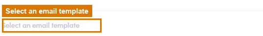

# 7.x.7 · Start from a Template

> 7 · Manage a Marketing Email → 7.x · Edge cases

**Start from a saved Template.** Rather than writing from scratch, use **Select an email template** (top of the step editor) to prefill the whole step from a saved template. You build & manage those in [Flow 3.x.1 · Templates ↗](3-x-1-templates-use-and-create.md).

*7.x.7: Select an email template (top of the editor) prefills the whole step.*
