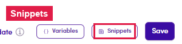

# 7.x.8 · Insert a Snippet

> 7 · Manage a Marketing Email → 7.x · Edge cases

**Insert a Snippet.** Click **Snippets** (bottom of the editor — it enables once your cursor is in the body) to drop in a saved reusable block. You build snippets in [Flow 3.x.2 · Snippets ↗](3-x-2-snippets-use-and-create.md).

*7.x.8 — the Snippets button (enables once the cursor is in the body).*
