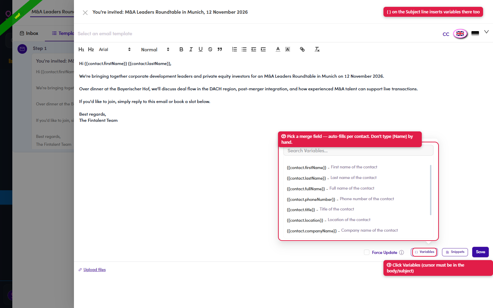

# 7.x.9 · Variables

> 7 · Manage a Marketing Email → 7.x · Edge cases

**Variables (merge fields) — the right way to personalize.** **Never type a name by hand** like "Hi [Name]" — that stays literal and won't personalize. Instead: put your cursor where you want it → click **Variables** → pick a field. The list covers **First name · Last name · Full name · Phone number · Title · Location · Company name · LinkedIn · Sponsor · Board observer**. It inserts a token like `{{contact.firstName}}` that fills in **per contact** when it sends. You can also add variables to the **Subject** line — click the **{ }** icon (next to CC, top-right).

*7.x.9 — ① click Variables (cursor in the body) · ② pick a merge field (don't type `[Name]` by hand) · the { } icon adds them to the Subject.*
