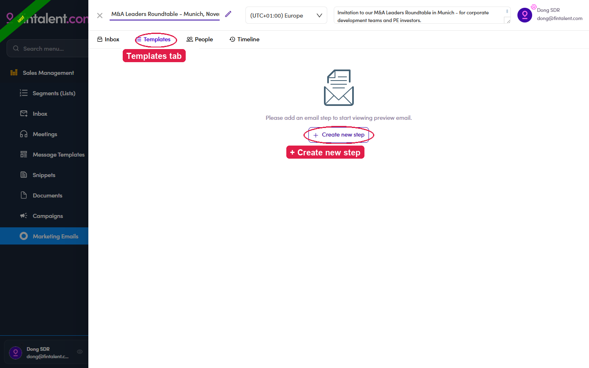
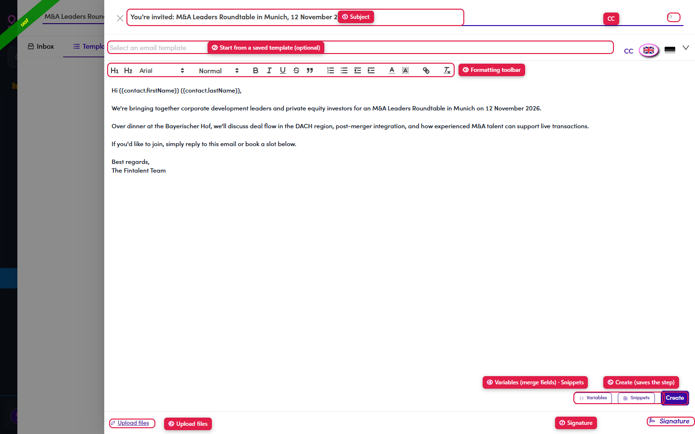
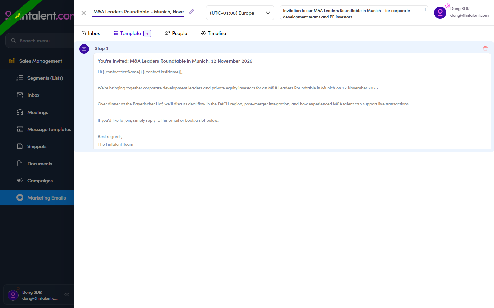

# 7b · Create / edit a template

> 7 · Manage a Marketing Email

**A sub-flow inside managing the ME.** Still on the **Templates** tab, you build the actual email a ME sends — a **step** (= one email) with its subject, body, variables and attachments. A brand-new ME opens with **no step yet** — it says *"Please add an email step to start viewing preview email"*. Click **+ Create new step**. **A step = one email.** (The **Preview** tab only appears once at least one step exists.)

*7b · empty state — a new ME's Templates tab: no step yet → + Create new step.*

The step editor opens — the core fields:

| Field / control | What it does |
|---|---|
| **Subject** | The email's subject line (top of the editor). You can drop **variables** in here too — via the **{ }** icon (see [7.x.9](7-x-9-variables.md)). |
| **Body** + formatting toolbar | The message. Full rich text: H1/H2, font & size, **B**/*I*/U/S, quote, lists, indent, colour, link, clear-format. |
| **Create / Save** | **Create** saves a brand-new step; re-open a step and the button reads **Save** instead. The **🗑 bin** on the step header deletes it. |

Everything else in the editor has its own edge case below — jump to it: [saved Template (7.x.7)](7-x-7-start-from-a-template.md) · [Variables (7.x.9)](7-x-9-variables.md) · [Snippets (7.x.8)](7-x-8-insert-a-snippet.md) · [CC (7.x.10)](7-x-10-cc.md) · [Upload files (7.x.12)](7-x-12-upload-signature.md) · [Signature (7.x.12)](7-x-12-upload-signature.md) · [Force Update (7.x.11)](7-x-11-force-update.md).

*7b — the step editor: ① Subject · ② start from a saved template · ③ formatting toolbar · ④ Variables / Snippets · ⑤ Force Update · ⑥ Save · ⑦ attachments · ⑧ Signature · CC.*

*7b · result — the Template tab now shows Step 1 with your subject + body (merge fields still shown raw here).*
