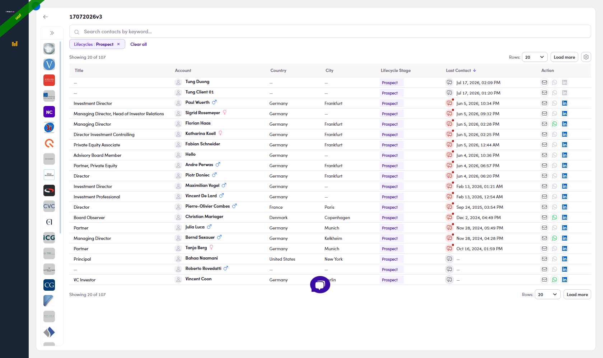
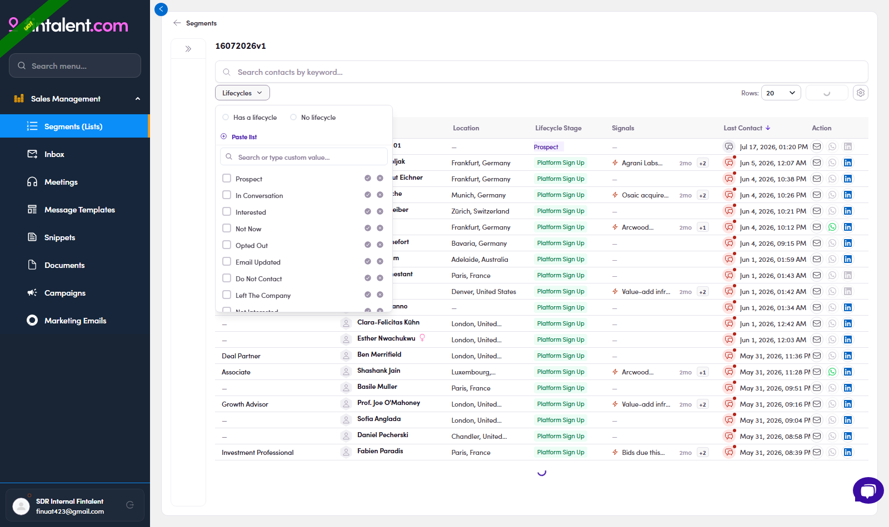
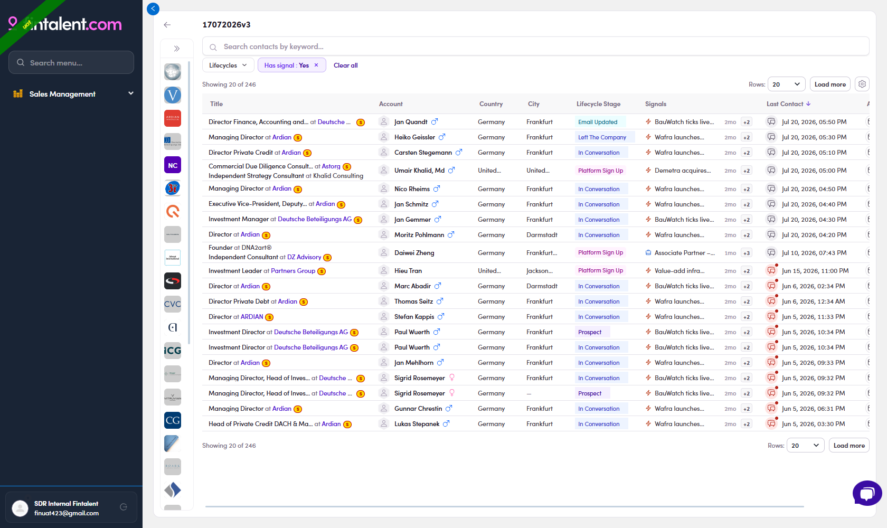

# 8.1 · List — members bar

> 8 · Using filters

The bar over the table filters the **people** in your list. **Which filters show depends on the table view** (the **Simple / Full** toggle, top-right of the table):

* **Simple view** (default) → **Lifecycles · Has signal**.

* **Full view** → a fuller bar: **Lifecycles · Campaign · Work Experience · Years of Experience · Countries · Cities** (Has signal drops off; Work Experience here is the same power filter as in the Inbox — see 8.3).

**Bonus — the keyword search has its own Simple / Advanced toggle** (top-right of the search box). **Advanced** lets you `-exclude` a word, wrap `"quotes"` for an exact match, drag terms to group them, and switch **AND / OR** to join them.

## Lifecycles — by stage (both views)

**"I want to find contacts whose lifecycle is Prospect."** → open **Lifecycles** → click the green **✓** on **Prospect**. ✓ include keeps only that stage; ✕ exclude hides it; several ✓ = OR; the **Has / No lifecycle** radios and **Paste list** are here too. Add **✕ Opted Out · ✕ Not Interested** to also drop the dead ones.

In actionThe list opens at **359** contacts (all stages). ✓ **Prospect** → **359 → 107**, and every remaining row shows "Prospect" in the Lifecycle Stage column. **Why:** ✓ include keeps only that stage, so the 252 at other stages are hidden.

*8.1 — chip Lifecycles : Prospect → Showing 20 of 107; every Lifecycle Stage cell = Prospect.*

*8.1 · control — ✓ include / ✕ exclude per value, Has / No radios, Paste list.*

## Has signal — people with fresh news (Simple view)

**"I want to find contacts who personally have a signal."** → open **Has signal** → tick **Yes** / **No**. Keeps people who have a ⚡ news / 💼 job signal — shown in the **Signals** column — the warmest people to reach out to. (This one lives on the **Simple**-view bar; switch to **Full** for Campaign · Work Experience · Years of Experience · Countries · Cities instead.)

In action359 → **246**: every remaining row has a value in the Signals column.

*8.1 — chip Has signal : Yes → Showing 20 of 246; the Signals column is filled on every row.*
