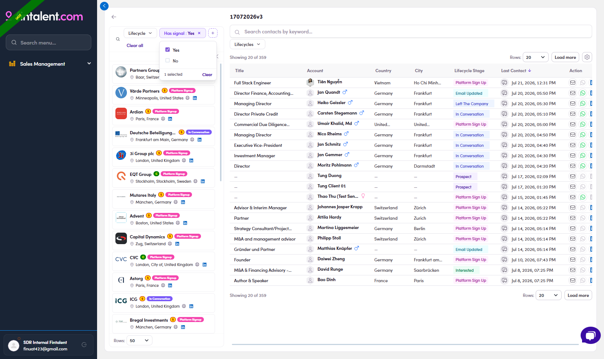

# 8.2 · List: company rail

> 8 · Using filters

Expand the rail (**»** on the left). Its bar filters **companies**, not people, pick a firm and its people show in the table. It carries **Lifecycle** and **Has signal** (+ 🔍 search).

## Has signal: firms with news

**"I want to find companies that have a fresh signal."** → on the rail, open **Has signal** → **Yes**. These are the best firms to open a conversation with; click one to see its people.

> **In action**
>
> Rail opens at **111** companies → **Has signal: Yes** → **111 → 29** firms.

*8.2: company rail Has signal: Yes → 29 firms.*

*8.2 · bars: members bar = Lifecycles · Has signal; company rail = Lifecycle · Has signal (+ 🔍 search).*

> **Same word, two levels**
>
> "Has signal" on the **rail** = the **company** has news; "Has signal" on the **members bar** (8.1) = the **person** has news. Pick the level you actually want.
