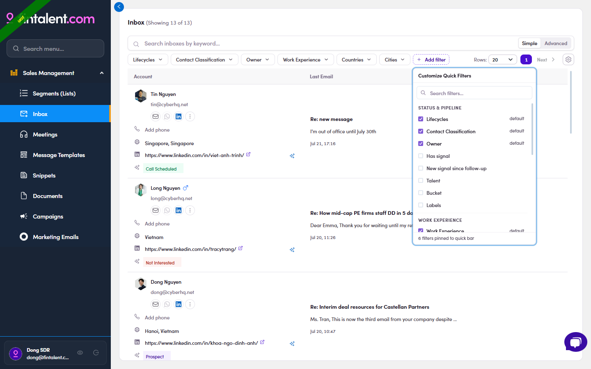
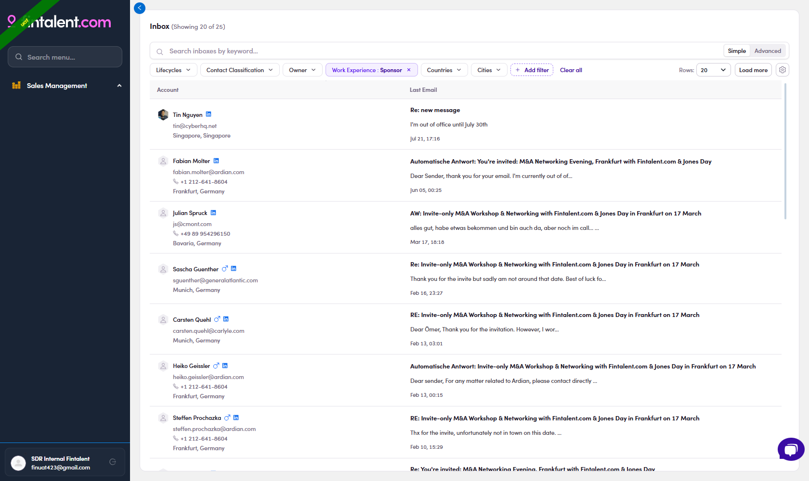
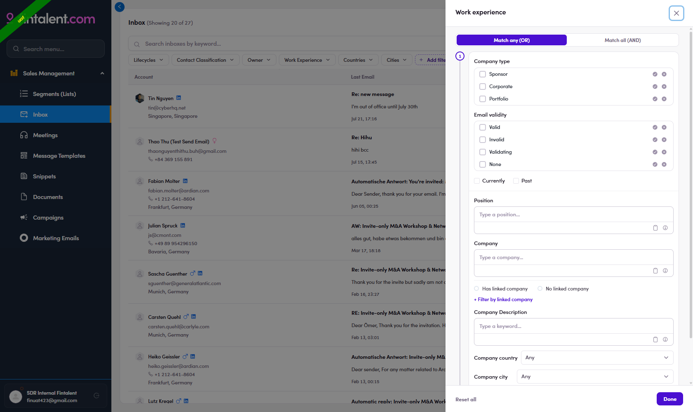

# 8.3 · Inbox filters

> 8 · Using filters

The Inbox bar carries the fullest set — combine them to zero in (e.g. only DACH sponsors who replied). Same ✓ / ✕ tool everywhere:

| Filter | "I want to find…" & how to use |
|---|---|
| **Lifecycles** | "…replies from contacts at a given stage." → ✓ / ✕ per stage (as in 8.1) |
| **Contact Classification** | "…replies from a given contact type." → **Talent · Client · Other** (✓ / ✕; Has / No; Paste list) |
| **Owner** | "…only replies on contacts I own." → pick yourself |
| **Work Experience** | "…people by their career facts (firm type, title, location…)." → see the panel below |
| **Countries · Cities** | "…contacts in a geography (DACH, UK…)." → pick the location |
| **+ Add filter** | **Customize Quick Filters** — the six above are pinned by **default**; open this to search the full catalog and pin / unpin any (Reset to defaults) |

**Pin more via + Add filter.** Beyond the six defaults, the catalog lets you pin:

| Extra filter | "I want to find…" |
|---|---|
| **Has signal** | "…replies from people who have a fresh ⚡ news / 💼 job signal." |
| **New signal since follow-up** | "…contacts I've already emailed who **just got a new signal**." A strong **re-engagement** trigger — they went quiet, but now there's fresh news to reach out about. |
| **Talent · Bucket · Labels** | "…by contact **type**, **bucket**, or **label**." |

*8.3 · + Add filter — Customize Quick Filters: 6 pinned by default (Lifecycles · Contact Classification · Owner · Work Experience · Countries · Cities); tick to pin Has signal · New signal since follow-up · Talent · Bucket · Labels.*

In actionInbox holds **27** replies → **Work Experience → Company type = Sponsor** (✓) → **27 → 25**; every remaining row is a PE sponsor firm (Ardian · General Atlantic · Carlyle).

*8.3 — chip Work Experience : Sponsor → Showing 20 of 25; rows are all sponsor firms.*

## Work Experience — the power filter

**"I want to find people who work at a Sponsor firm as a Managing Director."** This filters people by their **career**, not just the contact record. The top toggle **Match any (OR) / Match all (AND)** decides whether a person must meet *one* or *all* of:

* **Company type** — Sponsor · Corporate · Portfolio (✓ include / ✕ exclude) — used in the demo above.

* **Email validity** — Valid · Invalid · Validating · None.

* **Currently / Past** — the role is ongoing or historical.

* **Position** — job title (e.g. "Managing Director").

* **Company** — a specific firm; or **Has / No linked company**, plus **+ Filter by linked company** (its city · country · bucket · classification).

* **Company Description** — a keyword in the firm's description.

* **Company country / city**.

*8.3 · panel — the full Work Experience panel: Match any / all · Company type · Email validity · Currently / Past · Position · Company / linked · Description · country / city.*
