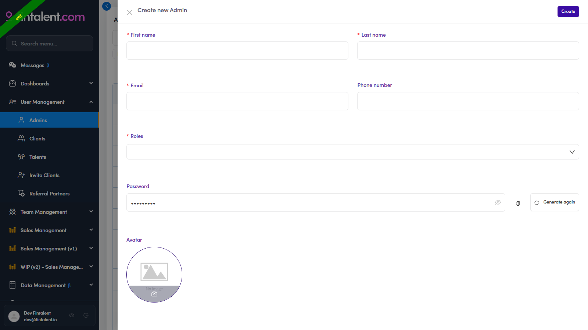

# A1.2 · Create the account

> A1 · Create an SDR/KAM account

## A1.2 · Click + Create New

(top-right of the Admins table) → the **Create new Admin** form opens.

## A1.3 · Fill in the details

**First name · Last name · Email** (= their login username; use the company email) · **Phone** (optional) · **Roles*** (pick **SDR** or **KAM** — tick both if they cover both) · **Password** (auto-generated). Regenerate / copy the password → [A1.x.1 ↗](a1-x-1-generate-password.md).

*A1.3 — Create new Admin form: Name · Email · Roles\* · auto-generated Password · Avatar.*

## A1.4 · Click Create

→ the new user appears in the table. Verify the role badge in the **Roles** column, then ask them to log in.
