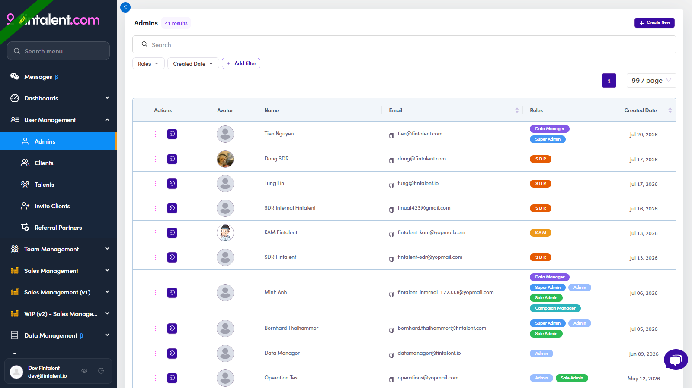

# A1 · Create an SDR / KAM account

> ADMIN · ADM.0.1

## A1.1 · Open Admins

1. **A1.1** — **User Management → Admins** → the users table (Actions · Avatar · Name · Email · **Roles** · Created Date). Every SDR/KAM/Admin lives here.

   

   *A1.1 — Admins: role badges per user, + Create New, and a Login-as icon in Actions.*

## A1.2 · Create the account

1. **A1.2** — **Click + Create New** (top-right of the Admins table) → the **Create new Admin** form opens.

2. **A1.3** — **Fill in the details** — **First name · Last name · Email** (= their login username; use the company email) · **Phone** (optional) · **Roles*** (pick **SDR** or **KAM** — tick both if they cover both) · **Password** (auto-generated). Regenerate / copy the password → [A1.x.1 ↗](a1-create-an-sdr-kam-account.md#a1-x-edge-cases).

   

   *A1.3 — Create new Admin form: Name · Email · Roles* · auto-generated Password · Avatar.*

3. **A1.4** — **Click Create** → the new user appears in the table. Verify the role badge in the **Roles** column, then ask them to log in.

## A1.x · Edge cases

1. **A1.x.1** — **Generate / copy the password.** In the Create form the **Password** is auto-generated. Click **Generate again** to make a new one, **copy it**, and send it to the hire through a private channel. They can change it after their first login.

   

   *A1.x.1 — the Password field: masked value · 👁 show/hide · copy · Generate again.*

2. **A1.x.2** — **Edit an existing account.** Admins → the user's row **⋮** → **Edit / View Details** → the **Update Admin Information** drawer. **General Setting** = name · phone · avatar · **Roles** (fix a wrong role here — no need to recreate). **Email Configuration** = **Signature** (auto-appended to every email they send) · **Sender Name** · default **Attach files** → **Save**. The drawer also carries **Billing · Payment · Activities Log** tabs (an SDR typically only needs **General Setting** + **Email Configuration**). (Best to set the signature here before their first send; the SDR can also edit their own later.)

   

   *A1.x.2a — (an SDR account) General Setting: name · phone · avatar · Roles.*

   

   *A1.x.2b — Email Configuration: Signature · Sender Name · Attach files → Save.*

3. **A1.x.3** — **Act truly as them — "Login as".** To use the app as that person (their assigned lists, their mailbox), on the **Admins** table each row has a **purple "Login as" button** in the **Actions** column (also reachable from the row **⋮** menu). Click it to enter the app as them. (This is how every SDR screenshot in this guide was captured.)

   

   *A1.x.3 — the Login as button (circled): one purple button per row in the Actions column.*

4. **A1.x.4** — **Preview what they'll see — "View as role".** The **eye icon** by your profile (bottom-left) → pick **SDR** → a banner "Viewing UI as SDR". It's **UI-only**: you still see **your own** data and your real permissions still apply — it just shows which menus/buttons/columns that role gets.

   

   *A1.x.4 — View as role → SDR: the preview banner + the trimmed SDR menu.*
