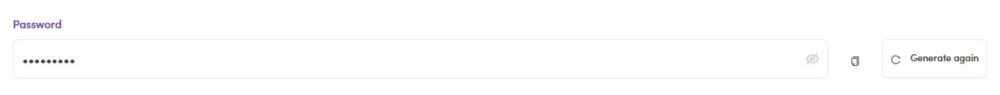

# A1.x.1 · Generate password

> A1 · Create an SDR/KAM account → A1.x · Edge cases

**Generate / copy the password.** In the Create form the **Password** is auto-generated. Click **Generate again** to make a new one, **copy it**, and send it to the hire through a private channel. They can change it after their first login.

*A1.x.1: the Password field: masked value · 👁 show/hide · copy · Generate again.*
