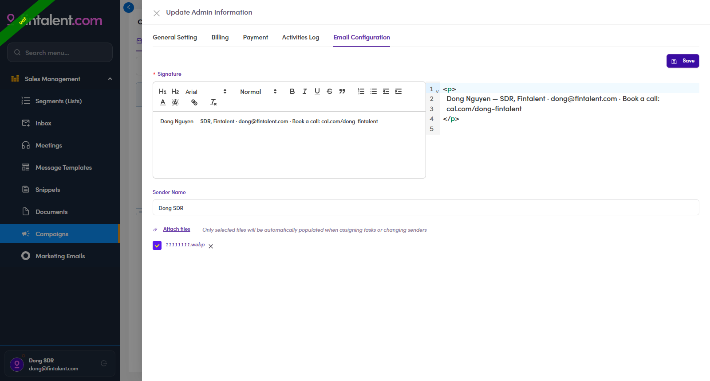

# A1.x.2 · Edit

> A1 · Create an SDR/KAM account → A1.x · Edge cases

**Edit an existing account.** Admins → the user's row **⋮** → **Edit / View Details** → the **Update Admin Information** drawer. **General Setting** = name, phone, avatar and **Roles** (fix a wrong role here, no need to recreate). **Email Configuration** = **Signature** (auto-appended to every email they send), **Sender Name** and default **Attach files** → **Save**. The drawer also carries **Billing, Payment and Activities Log** tabs (an SDR typically only needs **General Setting** + **Email Configuration**). (Best to set the signature here before their first send; the SDR can also edit their own later.)

*A1.x.2a: (an SDR account) General Setting: name · phone · avatar · Roles.*

*A1.x.2b: Email Configuration: Signature · Sender Name · Attach files → Save.*
