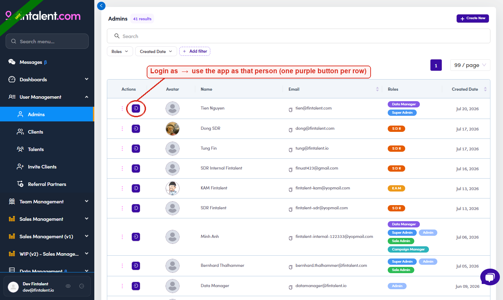

# A1.x.3 · Login as

> A1 · Create an SDR/KAM account → A1.x · Edge cases

**Act truly as them — "Login as".** To use the app as that person (their assigned lists, their mailbox), on the **Admins** table each row has a **purple "Login as" button** in the **Actions** column (also reachable from the row **⋮** menu). Click it to enter the app as them. (This is how every SDR screenshot in this guide was captured.)

*A1.x.3 — the Login as button (circled): one purple button per row in the Actions column.*
