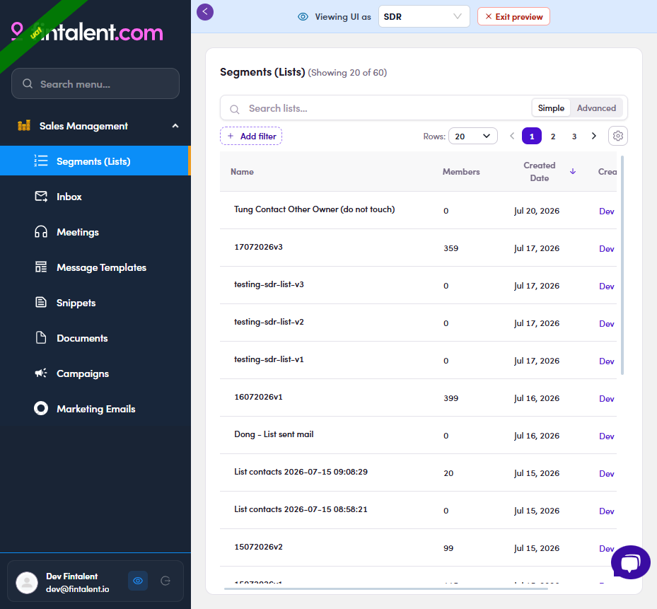

# A1.x.4 · View as role

> A1 · Create an SDR/KAM account → A1.x · Edge cases

**Preview what they'll see — "View as role".** The **eye icon** by your profile (bottom-left) → pick **SDR** → a banner "Viewing UI as SDR". It's **UI-only**: you still see **your own** data and your real permissions still apply — it just shows which menus/buttons/columns that role gets.

*A1.x.4 — View as role → SDR: the preview banner + the trimmed SDR menu.*
