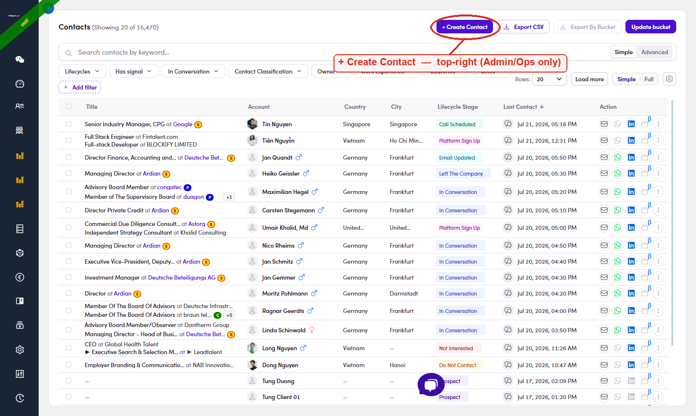
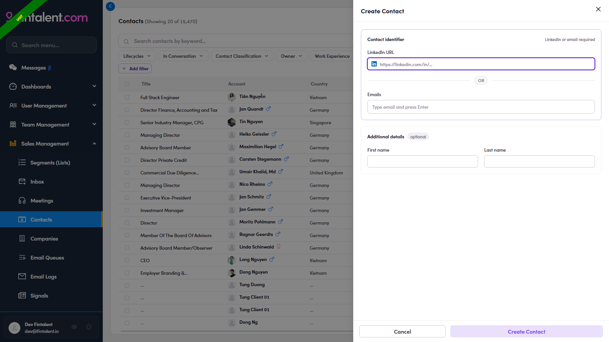

# A2.1 · Open the form

> A2 · Create a single contact

1. **A2.1** — **Sales Management → Contacts** → the contacts table. Top-right sits **+ Create Contact** (Admin/Ops only — the SDR view has no such button).

   

   *A2.1 — + Create Contact (circled) at the top-right of the Contacts page.*

2. **A2.2** — **Click + Create Contact** → the **Create Contact** drawer opens: **LinkedIn or email required** + an optional Name.

   

   *A2.2 — the empty drawer: LinkedIn URL OR Email, plus optional First/Last name.*
