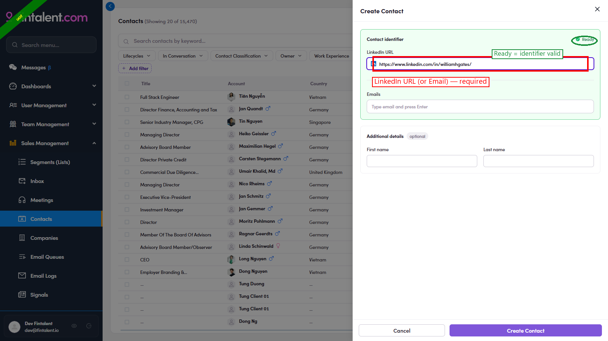
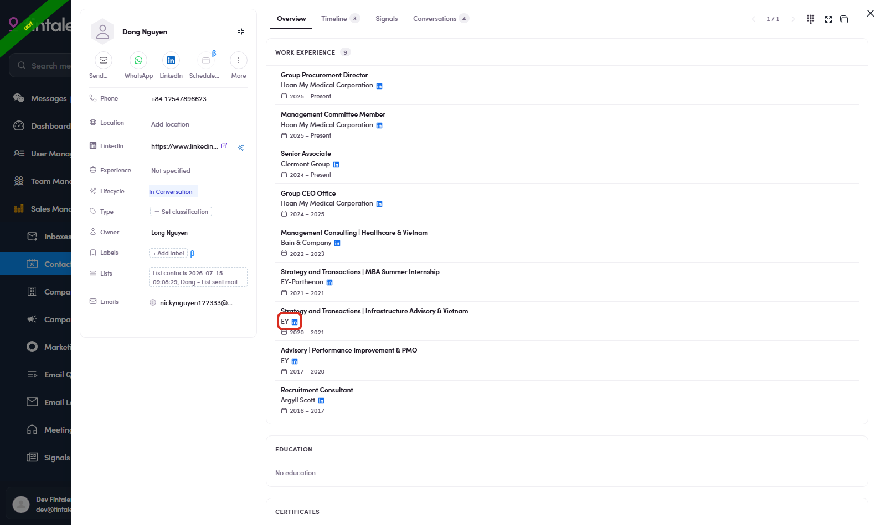
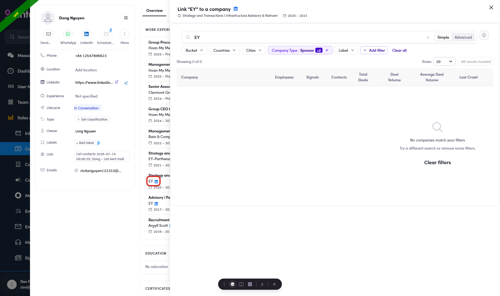
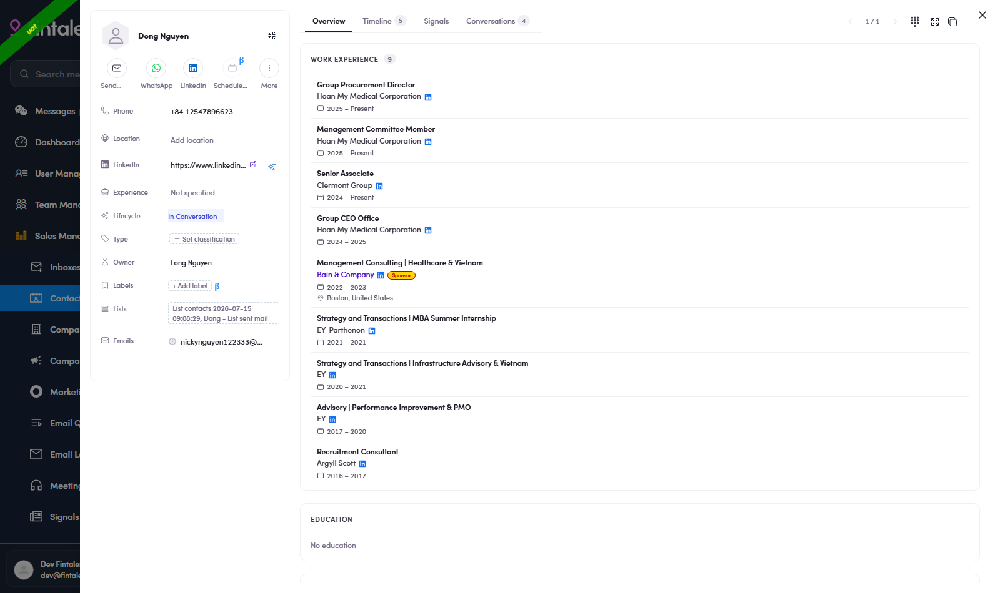

# A2 · Create a single contact

> ADMIN · ADM.0.3 · Admin/Ops only — the SDR view has no Create Contact button

## A2.1 · Open the Create Contact form

1. **A2.1** — **Sales Management → Contacts** → the contacts table. Top-right sits **+ Create Contact** (Admin/Ops only — the SDR view has no such button).

   

   *A2.1 — + Create Contact (circled) at the top-right of the Contacts page.*

2. **A2.2** — **Click + Create Contact** → the **Create Contact** drawer opens: **LinkedIn or email required** + an optional Name.

   

   *A2.2 — the empty drawer: LinkedIn URL OR Email, plus optional First/Last name.*

## A2.2 · Enter the details & create

1. **A2.3** — Enter a **LinkedIn URL** *or* an **Email** (**≥1 required** — it's the dedupe key; the card shows **✓ Ready** once valid). With a **LinkedIn URL** the system **auto-pulls** the person's **name · total years of experience · avatar · location · work experience** (when available) — so First/Last name are optional. → **Create Contact**.

   

   *A2.3 — example: a LinkedIn URL entered → ✓ Ready. On Create, the system crawls name · years of experience · avatar · location · work experience back into the contact.*

## A2.x · Edge cases

1. **A2.x.1** — **Duplicate found (email / LinkedIn already exists).** Entering an identifier that already exists opens the **"Duplicate Found"** panel with the existing contact — **edit them there**, or **Back** to enter different info. Nothing duplicate is ever created.

   

   *A2.x.1 — Duplicate Found: the existing contact appears; Back / Done.*

2. **A2.x.2** — **Link / relink a work experience to a company.** On a contact's Work Experience, an **unlinked** row (company shown as plain text) has a **Link company** icon → a company picker (the company must already exist in **Companies**; 0 results → shorten the keyword) → clicking links **immediately** (toast "Linked") → a bonus **"Apply to N other contacts"** fixes the same mislink everywhere. A row that's **already linked** shows **Relink** instead — it re-points to a **different** company (company-scoped: moves every experience matched to the old company).

   

   *A2.x.2a — the Link icon on an unlinked experience row.*

   

   *A2.x.2b — the company picker (company must exist; 0 results → shorten keyword).*

   

   *A2.x.2c — result: company as a purple link + type badge; a Relink icon on the linked row.*

3. **A2.x.3** — **Neither LinkedIn nor email.** Creation is **blocked** — the form requires one of the two.

4. **A2.x.4** — **Supplement the info (edit after create).** A fresh contact — even one auto-filled from LinkedIn — is often missing details the crawl can't reach: **Phone**, **Contact Classification**, **Owner**, extra emails, lifecycle, etc. Open the contact → the detail drawer → **click the empty field** → type or pick the value → it **auto-saves** (toast "Saved"). Fill these in before assigning the person into a working list.
