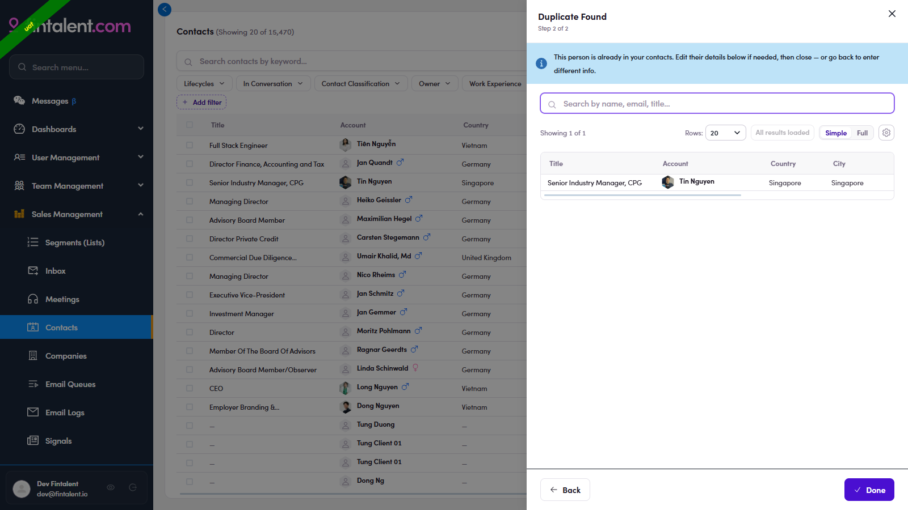

# A2.x.1 · Duplicate found

> A2 · Create a single contact → A2.x · Edge cases

**Duplicate found (email / LinkedIn already exists).** Entering an identifier that already exists opens the **"Duplicate Found"** panel with the existing contact — **edit them there**, or **Back** to enter different info. Nothing duplicate is ever created.

*A2.x.1 — Duplicate Found: the existing contact appears; Back / Done.*
