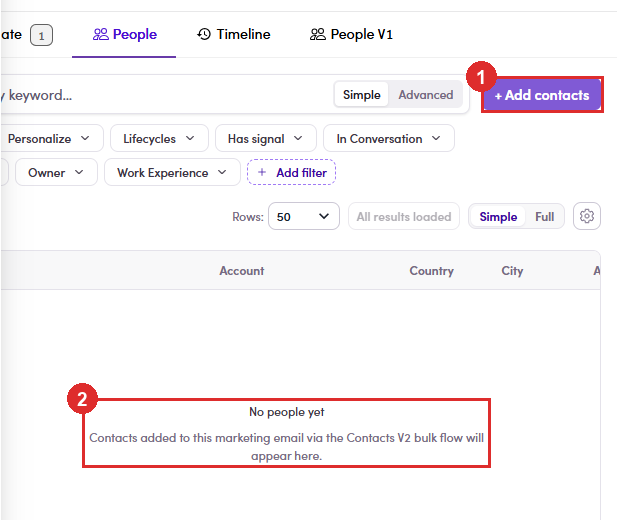
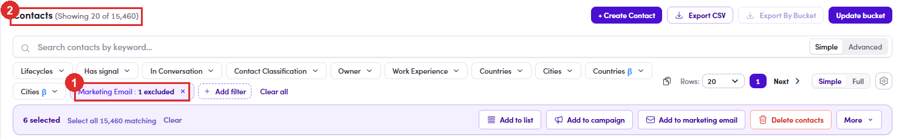
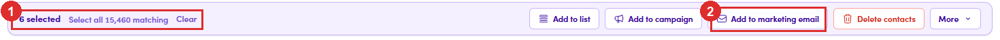
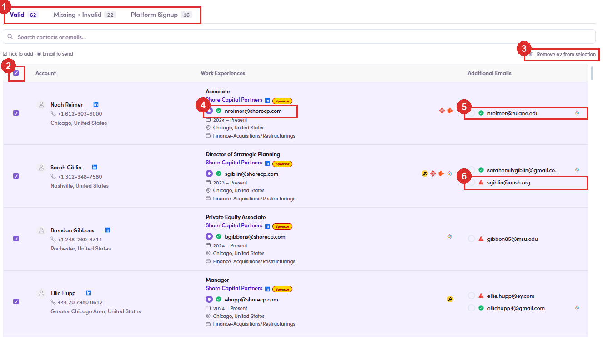
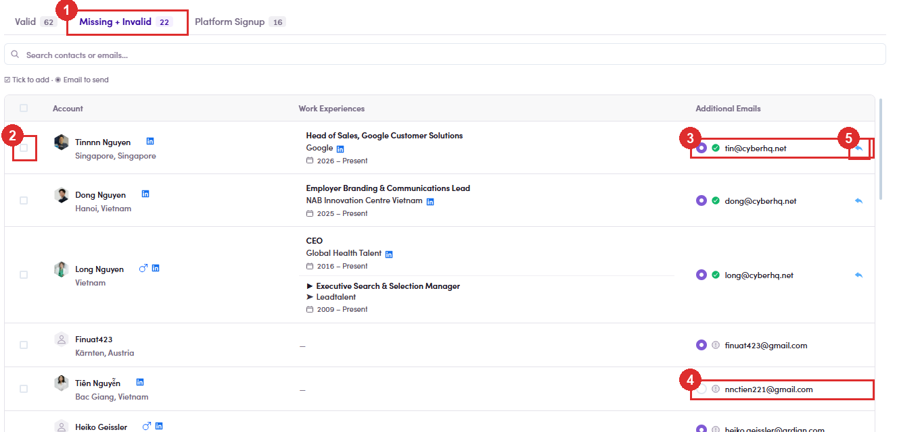
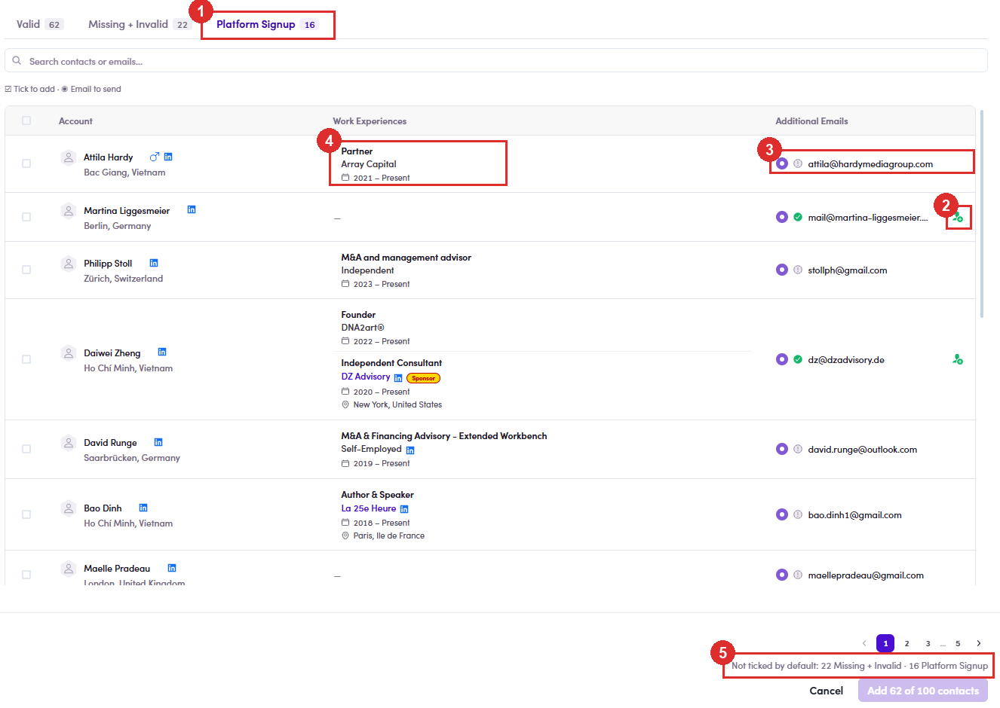
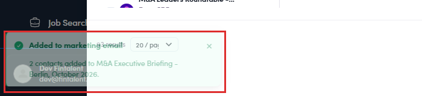

# A3.0 · Add contacts

> A3 · Run a ME / campaign

Do this before anything in A3.1A marketing email with no recipients cannot be run, and the People count is one of the two numbers the run check looks at ([A3.1.2 ↗](a3-1-run-a-marketing-email.md)). Verified end to end on UAT, 3 August.

## A3.0.1 · Start from the marketing email, not from Contacts

Open the ME → **People** tab. An empty one says so plainly, and tells you the only way in: *“No people yet — Contacts added to this marketing email via the Contacts V2 bulk flow will appear here.”*

*A3.0.1 — ① + Add contacts, top right of the tab · ② the empty state naming the bulk flow.*

## A3.0.2 · + Add contacts does not open a picker — it takes you to Contacts

You land on the full **Contacts** list with a filter already applied: a chip reading **Marketing Email : 1 excluded**. That chip is doing real work — it hides everyone already in this ME, so whatever you tick next is genuinely new. You have left the marketing emailThis is a normal Contacts page now. The full filter bar is yours — Lifecycles, Has signal, Countries, Work Experience, keyword search. Narrow the list here rather than ticking your way down 15,000 rows.

*A3.0.2 — ① the Marketing Email : 1 excluded chip · ② the row count you are working against.*

## A3.0.3 · Tick the contacts you want

A selection bar appears with the count, **Select all N matching** for the whole filtered set, and **Clear**. Of the actions on the right, the one you want is **Add to marketing email** — the neighbours add to a list or a campaign instead, and **Delete contacts** sits two buttons away.

*A3.0.3 — ① the count and Select all N matching · ② Add to marketing email.*

## A3.0.4 · The drawer is two panes, and both matter

It opens titled **Add N contacts to marketing email**. **Read the legend above the table** — *“☑ Tick to add · ◉ Email to send”*. Two different controls: the checkbox decides **whether** the contact goes in, the radio beside each address decides **which address** gets used. **What each bucket actually means — and when to tick it:** **When a contact has more than one address, the system has already chosen one.** It picks by priority — a **valid** address first, then one belonging to a **sponsor company**, and so on down. The chosen address carries the filled radio; any others sit under **Additional Emails**. **You can overrule it right here.** Click the radio next to a different address and that is where the email goes. Worth a look whenever someone has a work address and a personal one — the automatic pick is a sensible default, not a decision about which inbox this particular message belongs in.

| Pane | What it does |
|---|---|
| **Left — Select marketing email** | every ME you can reach, searchable and sortable. Each row shows **name · owner · status chip · N recipients**, so you can tell a Draft from something already sending before you pick it. |
| **Right — the contacts** | split into three buckets: **Valid** · **Missing + Invalid** · **Platform Signup**, each with its own count. **They are not a quality ranking** — which ones you tick depends on what the email is for. See below. |

| Bucket | What is in it | Tick it? |
|---|---|---|
| **Valid** | The safe ground. The address is confirmed working, so a send has a high chance of landing rather than being dropped. | **Yes** — pre-ticked for you. |
| **Missing + Invalid** | **Needs a human look.** The *work* address is missing or unusable, so the pick falls back to a personal one — unverified rather than proven bad. Most are reachable; nobody has checked. | **Your call.** Tick individually if you are willing to risk a bounce on that name; leave it if you would rather not spend the sender reputation. |
| **Platform Signup** | People who **already have a Fintalent account** — talent or client. Nothing to do with whether the address works. | **Depends entirely on the campaign.** See the rule below. |

| The email is aimed at… | Platform Signup | Why |
|---|---|---|
| **Talents** | **Tick all of them** | These are your talents. Leaving them out means mailing everyone except the audience. |
| **Prospective clients** | **Judgement call** | Having an account already suggests they may be a client. Whether that makes them a target or means you should leave them alone depends on the campaign — decide deliberately, do not let the default decide for you. |

*A3.0.4 — ① pick the ME (status and recipient count on every row) · ② the three buckets · ③ tick-to-add vs email-to-send · ④ the confirm button and the line above it.*

## A3.0.5 · Tab 1 — Valid: everything here is already ticked

Rows are shaded and the header checkbox is on. The address being used sits in the **Work Experiences** column beside the company — the work address, right under the **Sponsor** chip. On UAT, 52 of the 62 picked there and **not one** fell back to a personal address. Whatever is listed under **Additional Emails** is an alternative. It is normal for those to be red — they are not the address being sent to, so a red alternative is not a problem to fix. **Remove N from selection**, top right, unticks the whole tab in one click — useful when you meant to send only to the other buckets. **The icons mean the same thing in all three tabs.** Hover any of them; these are the tooltips, read off UAT:

| Icon | Tooltip | What it means for you |
|---|---|---|
| green tick | **Valid** | the address is confirmed working |
| red triangle | **Invalid** | known bad — sending here costs you sender reputation |
| grey circle | **Not verified** | never checked. Not proven bad, just unknown |
| blue arrow | **Replied from this email** | this person has written back from that address before |
| green person | **Platform Signup** | they hold a Fintalent account |

*A3.0.5 — Valid. ① the three counts, adding up to your selection · ② header checkbox on, every row ticked · ③ Remove 62 from selection · ④ the address in use, on the work experience · ⑤ an alternative address · ⑥ an alternative that is Invalid — harmless, it is not the one selected.*

## A3.0.6 · Tab 2 — Missing + Invalid: nothing ticked, and the pick has fallen back

On UAT, 17 of the 22 had no usable work address, so the radio landed on a personal one under **Additional Emails** while the **Work Experiences** column shows the job with no address against it. That is what the tab name means: the *work* address is missing or unusable — not that the person is unreachable. The blue **Replied from this email** arrow is the best reason to tick one of these by hand. Someone who has already written back from an address is a far safer bet than the bucket label suggests. ⚠ One row had no address selected at allNot every row here has a pick. Tick a contact whose radio is empty and you add someone with nowhere to send — check the **radio**, not just the checkbox.

*A3.0.6 — Missing + Invalid. ① the tab · ② nothing ticked · ③ the pick fallen back to a personal address · ④ a row with no address picked at all · ⑤ Replied from this email.*

## A3.0.7 · Tab 3 — Platform Signup: people who already hold a Fintalent account

Nothing is pre-ticked. All 16 rows picked a personal address; none had a work one. The marker is the green person icon at the end of the row — hover it and it reads *Platform Signup*. **This tab says nothing about address quality.** An address in here can be green **Valid** and still sit outside the Valid tab, because holding an account is what put it here. Judge it on who the email is for, not on the data. ⚠ Skip this tab and you may miss the whole audienceIf the email is aimed at **talents**, these *are* your talents — leaving the tab unopened mails everyone except the people it was written for. Go back to the bucket table in [A3.0.4 ↗](a3-0-add-contacts.md) and decide deliberately. The **N results** count and page numbers along the bottom belong to the **marketing email list on the left**, not to the contacts — 93 results was 93 MEs. The buckets are not paginated; each tab shows all of its rows.

*A3.0.7 — Platform Signup. ① the tab · ② the green Platform Signup marker · ③ a personal address, Not verified · ④ a work experience carrying no address · ⑤ the line that names both unticked buckets.*

## A3.0.8 · ⚠ Read the button before you click it — it will not add everyone you ticked

Confirm reads **Add 2 of 6 contacts**, and directly above it: **Not ticked by default: 4 Missing + Invalid**. Only the **Valid** bucket is pre-ticked. Contacts with a missing or unusable address are carried into the drawer but left **unticked on purpose**, so selecting six people and adding two is the expected outcome, not a fault. Measured on UAT: six selected → `Valid 2 · Missing + Invalid 4 · Platform Signup 0` → button `Add 2 of 6 contacts`. **If you want the excluded ones anyway**, open the **Missing + Invalid** tab and tick them yourself — but fix the address first, or they will bounce ([7.7a ↗](7-7-verify-in-conversations.md)).

## A3.0.9 · Confirm, and read the toast

It names both the number and the email: **“Added to marketing email — 2 contacts added to M&A Executive Briefing - Berlin, October 2026.”** That is your receipt — the one moment the system tells you what actually went in.

*A3.0.9 — the toast, bottom left. It clears quickly, so read it as it appears.*

## A3.0.10 · Check the People tab

Go back to the ME — the **People** tab badge should carry the new total. If it does not match what the toast said, something was dropped; re-run the add rather than assuming it landed.
