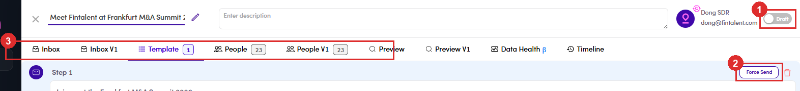

# A3.1 · Run a Marketing Email

> A3 · Run a ME / campaign

This is the handover pointThe SDR builds the ME and marks people reviewed ([Flow 7 ↗](7-manage-a-marketing-email.md)). **Only an Admin can make it send.** Both controls below are invisible to the SDR login, so if a rep says “I finished it and nothing happened”, this is the step nobody did.

## A3.1.1 · Open the ME

Left menu → **Sales Management → Marketing Emails**, then click its name. The list tabs are **All · Draft · Paused · Running · Finished** — anything waiting on you is under **Draft**.

## A3.1.2 · Check it is actually ready before you touch anything

The tab bar carries the two numbers that decide whether sending is safe: Read the step body too — it is shown in full on the Template tab, merge fields and all (`{{contact.firstName}}`). This is the last easy moment to catch a broken link or a wrong name.

| Tab | What to look for |
|---|---|
| **Template** (with a count) | a count of **0** means no email exists yet — the ME cannot send anything. You get *“Please add an email step to start viewing preview email”* and a **Create new step** button instead. |
| **People** (with a count) | how many recipients are attached. **0** means activating does nothing at all. |

## A3.1.3 · Activate it

the switch at the **very top right** of the drawer, reading **Draft**. Flip it and the ME becomes **Active** (the list calls this **Running**). It is easy to missThe switch sits right at the edge of the drawer, above the tab bar and past the description box. On a narrow window it can be off-screen — widen the browser rather than assuming the ME has no switch.

## A3.1.4 · Force Send

on the **Template** tab, top-right of the **Step 1** panel, beside the red delete-step bin. This is the button that actually pushes the emails into the queue. **Only contacts the SDR marked *Content Reviewed* are sent.** Anyone left unreviewed stays put — which is the safety net, and also the usual reason the queue comes out smaller than the People count.

*A3.1.3–4 — ① the Draft switch, top right · ② Force Send on the step · ③ the tab bar with the Template and People counts.*

## A3.1.5 · Check the Email Queue tab

One row per email: **In Queue** (waiting) → **Delivered** (gone, with a Sent Date) or **Cancel** (pulled, will not send). The count should match the reviewed contacts — if it does not, that is the number to chase, not the People count. Full tour of the queue, its four tabs and its row actions in [7.6 ↗](7-6-email-queue-3-tabs.md).

*A3.1.5 — after Force Send: per-email status and Sent Date. The SDR view of this tab can show 0 / “Couldn't load” for a while — a display lag, not a failed send.*

## A3.1.6 · Then hand it back

Replies land in the ME's own **Inbox**, and the SDR works them from there ([Flow 7 ↗](7-manage-a-marketing-email.md)). Your part is done once the queue looks right.
