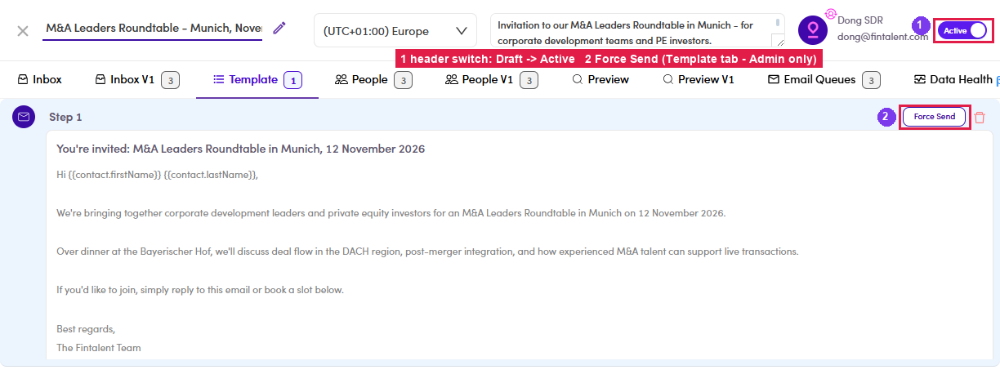
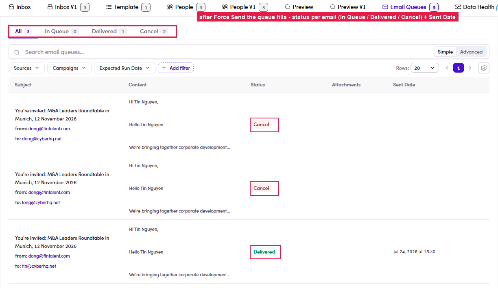

# A3.1 · Run a Marketing Email

> A3 · Run a ME / campaign

1. **A3.1.1** — Open the **Marketing Email** the SDR prepared.

2. **A3.1.2** — **Activate it:** flip the header switch **Draft → Active** (top-right).

3. **A3.1.3** — Go to the **Template** tab → click **Force Send** (top-right of the step). This button is **Admin-only** — the SDR login doesn't see it. Only contacts the SDR marked **Content Reviewed** are sent.

   

   *A3.1 — ① header switch Draft → Active · ② Force Send on the Template tab (Admin-only).*

4. **A3.1.4** — **Check the Email Queue** tab — it fills with one row per email: **In Queue** (waiting) → **Delivered** (sent, with Sent Date) or **Cancel** (pulled — will not send). The count should match the reviewed contacts.

   

   *A3.1.4 — after Force Send: the queue with per-email status and Sent Date. (The SDR view of this tab currently shows 0 / “Couldn't load” — known display bug; the data is here on the Admin view.)*
