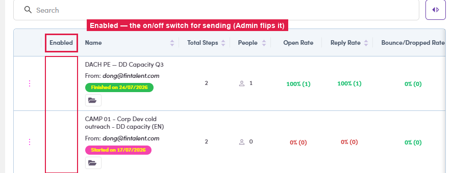

# A3.2 · Run a campaign (Enabled)

> A3 · Run a ME / campaign

1. **A3.2.1** — Open **Campaigns** → find the campaign (the SDR sets it **Draft → Scheduled**; you run it).

2. **A3.2.2** — Flip the **Enabled** toggle on its row — that turns the sending **on**; the status moves through **Running → Finished** (or **Paused** if you flip it off).

   

   *A3.2 — the Enabled toggle on the campaign list — the on/off switch for sending (Admin-only).*

3. **A3.2.3** — The campaign detail (Steps · People · Preview · Email Queues) looks **the same as the SDR view** — see SDR [Flow 6 ↗](6-manage-a-campaign.md) for every tab.
