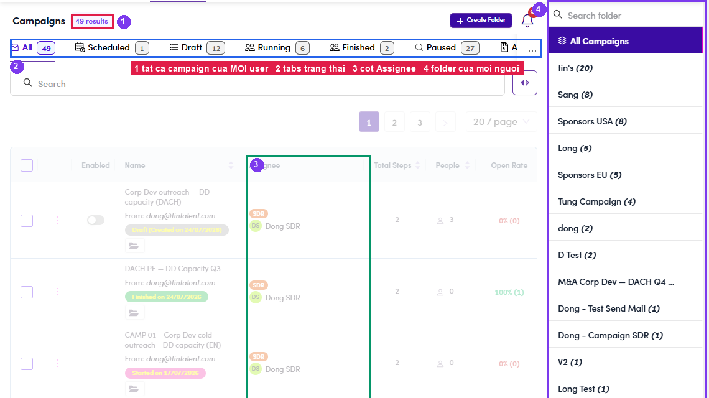
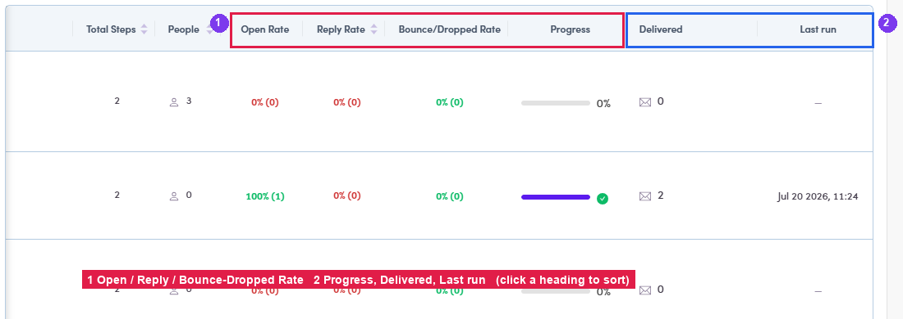
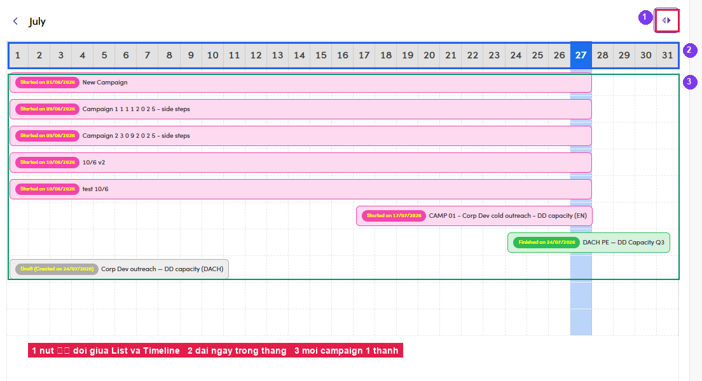

# A4.1 · The list

> A4 · Manage a campaign (Admin)

1. **A4.1.1** — **Sales Management → Campaigns.** The header count is the **whole workspace**, not your own — the SDR only ever sees campaigns assigned to them.

   

   *A4.1 — ① every campaign in the workspace · ② status tabs · ③ the Assignee column (Admin-only) · ④ every user's folders in the right pane.*

2. **A4.1.2** — **Status tabs.** **All · Scheduled · Draft · Running · Finished · Paused · Archive** — each with a live count. **Archive** only exists here; that's where [A4.x.2 ↗](a4-x-2-archive-vs-delete.md) puts things.

3. **A4.1.3** — **The folder pane (right).** Lists **all** folders with their campaign counts — *tin's (20)*, *Sang (8)*, *Sponsors USA (8)*… Click one to scope the list, use **Search folder** to find it, **+ Create Folder** to add one. An SDR sees only their own folders, so **you are the one who can tidy across people**.

4. **A4.1.4** — **Read a row.** Left to right: **checkbox** (bulk) · **⋮** (row menu) · **Enabled** toggle · **name + From address + status pill + folder chip** · **Assignee** (role badge + person) · **Total Steps** · **People**.

5. **A4.1.5** — **Scroll right for the numbers:** **Open Rate · Reply Rate · Bounce/Dropped Rate · Progress · Delivered · Last run**. Headers with ⇅ are sortable — sort by **Bounce/Dropped Rate** to find the campaign that is burning the domain.

   

   *A4.1.5 — ① the three rates · ② Progress bar (✓ when finished) · Delivered · Last run.*

6. **A4.1.6** — **Timeline view.** The **⟨⟩** button beside the search box swaps the table for a **month timeline** — one bar per campaign across the days, today highlighted, **‹** **›** to change month. Fastest way to see what is **overlapping** before you turn another one on.

   

   *A4.1.6 — ① the ⟨⟩ toggle · ② the day strip · ③ one bar per campaign, coloured by status.*
