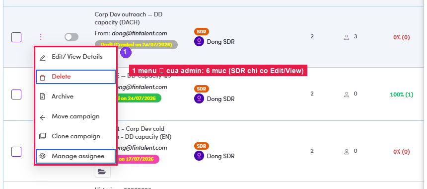
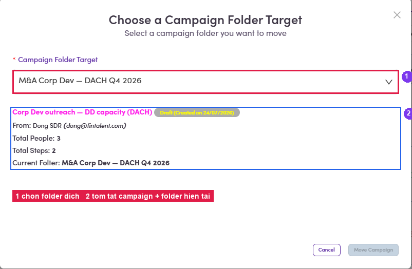
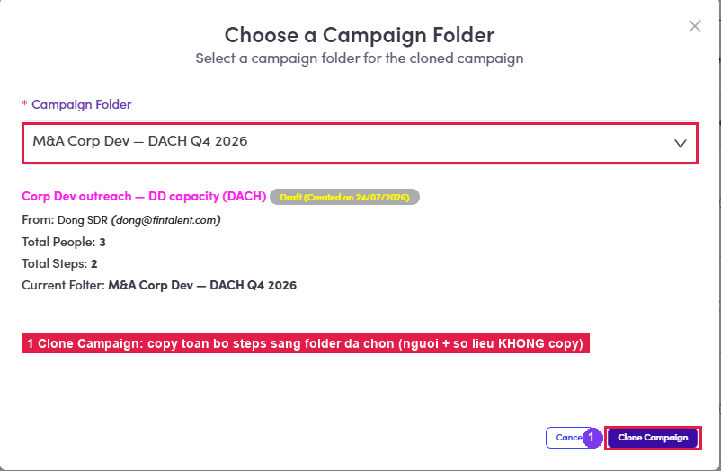

# A4.2 · Row actions (⋮)

> A4 · Manage a campaign (Admin)

## A4.2.1

Click **⋮** on any row. **Edit/View Details · Delete · Archive · Move campaign · Clone campaign · Manage assignee.** The SDR view of the same menu has **Edit/View Details only**.

*A4.2.1 — the six-item Admin row menu; Delete (top) and Manage assignee (bottom) are the two the SDR never gets.*

## A4.2.2 · Move campaign

→ *Choose a Campaign Folder Target*. Pick the destination folder; the dialog prints the campaign, its **From**, **Total People**, **Total Steps** and its **current folder** so you can check you grabbed the right row → **Move Campaign**.

*A4.2.2 — ① target folder · ② the summary that confirms which campaign you are moving.*

## A4.2.3 · Clone campaign

→ same dialog, but the folder you pick is where the **copy** lands. Use it to reuse a proven sequence for the next segment instead of retyping the steps.

*A4.2.3 — ① Clone Campaign. The clone starts as a fresh Draft — see [A4.x.1 ↗](a4-x-1-what-a-clone-copies.md) for what does not come along.*

## A4.2.4 · Archive

takes it out of the working tabs into **Archive**; **Delete** removes it. Prefer **Archive** — the numbers stay reachable.
