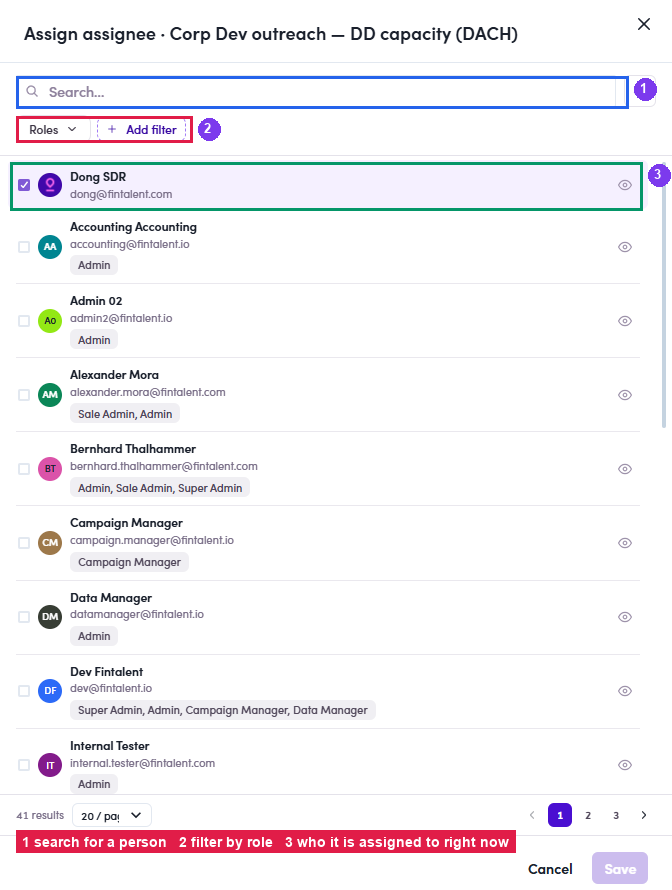
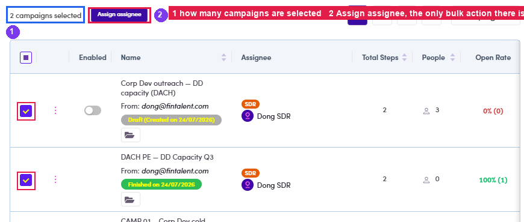

# A4.3 · Reassign

> A4 · Manage a campaign (Admin)

## A4.3.1 · ⋮ → Manage assignee

opens **Assign assignee**: search by name/email, filter by **Roles**, **+ Add filter**, and the current owner is pre-ticked. Pick the new person → **Save**. This is what you use when an SDR leaves or a book gets rebalanced.

*A4.3.1: ① search · ② Roles filter · ③ the person currently assigned.*

## A4.3.2 · In bulk

tick several rows → the bar shows **“N campaigns selected”** + **Assign assignee**. That is the **only** bulk action on this page. There is no bulk delete/move, so a mis-click can't wipe a book.

*A4.3.2: ① selection count · ② the single bulk action.*
