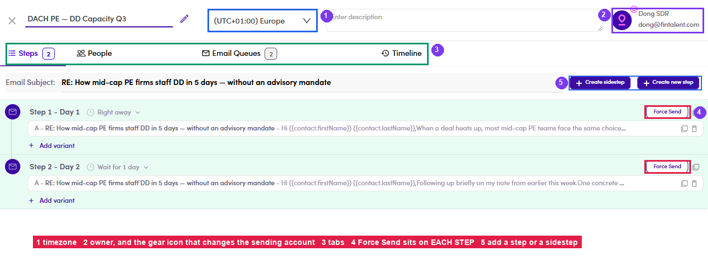
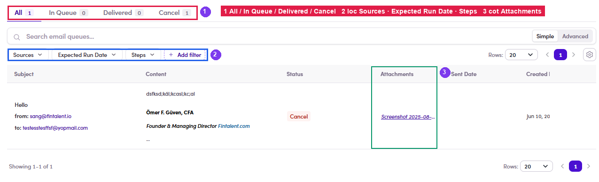

# A4.4 · Inside the campaign

> A4 · Manage a campaign (Admin)

## A4.4.1 · Open it

(click the name, or **⋮ → Edit/View Details**). The header carries: editable **name** (✎) · **timezone** · **description** · the **owner** with a **⚙** badge · and, once it is live, the **Active** switch.

*A4.4.1 — ① timezone (drives send hours) · ② owner + ⚙ sending account · ③ the tab row · ④ Force Send on each step · ⑤ Create new step / Create sidestep.*

## A4.4.2 · The tab row depends on state

A Draft or Finished campaign shows **Steps · People · Email Queues · Data Health β · Timeline**; once it is running you also get **Inbox** and **Preview**. (You may also see “V1” duplicates of these tabs — legacy screens kept around for comparison. Ignore them.)

## A4.4.3 · Force Send per step

(Admin-only). Each step has its own **Force Send** — it pushes that step now instead of waiting for its *Right away* / *Wait for N days* timing. Use it to unblock a step that missed its window; don't use it to skip a wait you set on purpose.

## A4.4.4 · ⚙ on the owner avatar → change the sending account

It opens the list of Fintalent accounts (the current one is not in the list) — picking one switches the account the campaign sends **From**. The list page then shows the new **From:** address on the row.

## A4.4.5 · Email Queues

sub-tabs **All · In Queue · Delivered · Cancel**, filters **Sources · Expected Run Date · Steps**, and an **Attachments** column the SDR-side write-up doesn't cover. This is where you prove an email actually left.

*A4.4.5 — ① the four sub-tabs · ② filters · ③ Attachments.*
