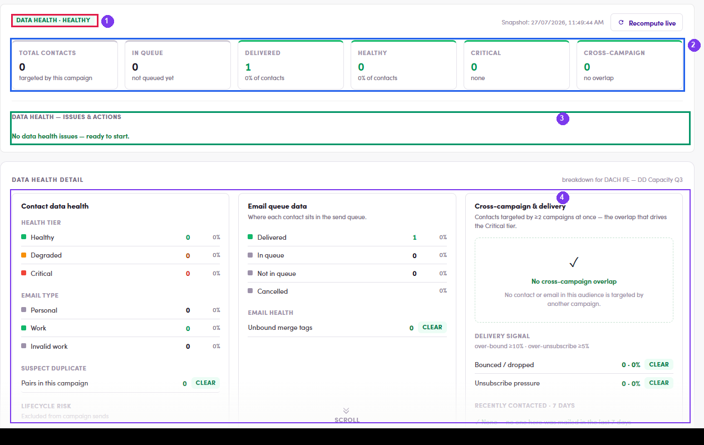

# A4.5 · Data Health

> A4 · Manage a campaign (Admin)

1. **A4.5.1** — Open **Data Health β**. A campaign that has never been scanned says **“No health snapshot yet”** → **Recompute live**.

2. **A4.5.2** — **Read the verdict + six cards:** **Total contacts · In queue · Delivered · Healthy · Critical · Cross-campaign**, with the badge (**HEALTHY** / **CRITICAL**) and the snapshot timestamp.

   

   *A4.5 — ① verdict · ② the six cards · ③ Issues & Actions · ④ the three detail columns.*

3. **A4.5.3** — **Work the detail columns.** Each line has a **CLEAR** chip when it is at zero — that is the “nothing to fix here” marker, not a button that fixes something.

   - **Contact data health** — Health tier (Healthy / Degraded / Critical) · Email type (Personal / Work / Invalid work) · **Suspect duplicate** pairs · **Lifecycle risk** (contacts excluded from sends).

   - **Email queue data** — Delivered / In queue / Not in queue / Cancelled, plus **Unbound merge tags** (a `{{contact.firstName}}` with nothing behind it).

   - **Cross-campaign & delivery** — contacts targeted by **≥2 campaigns at once** (the thing that drives the Critical tier), the **delivery signal** thresholds (**over-bound ≥10%**, **over-unsubscribe ≥5%**) and **recently contacted · 7 days**.

4. **A4.5.4** — Anything under **Issues & Actions** comes with a **Review →** that jumps to the offending contacts. Clear the Critical ones before flipping **Enabled**.
