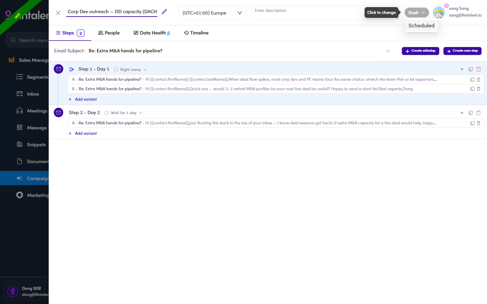

# A4.6 · Run a campaign

> A4 · Manage a campaign (Admin)

**This is the one thing an SDR cannot do.** Everything up to here they can prepare; turning the campaign on is yours.

## A4.6.1 · The SDR tells you it is ready

Nothing arrives on its own, so the trigger is a message from them, not a queue you can watch. What ready means on their side: [6.6 ↗](6-6-hand-it-over-to-be-run.md).

## A4.6.2 · Review it again, as much as you want to

Open the campaign and go to the **Preview** tab, the same screen the SDR used. Read whichever contacts you want to read; the **Done** filter splits the list into the ones they have been through and the ones they have not.

## A4.6.3 · Click the status toggle

, top right of the campaign, beside your name. It reads **Draft** until you touch it. A dialog opens.

*A4.6.3: the status control on the campaign, reading Draft.*

## A4.6.4 · Read the dialog before you confirm

It repeats the campaign name and status, the sending address, and the size of what you are about to start, for example **12 contacts · 2 steps**. If anybody is still unreviewed it says so, in a yellow band: *N contact are not marked as done.*

> **The warning does not stop you**
>
> **Run Campaign** stays enabled whether or not everyone is marked done. So the count is a prompt to think, not a gate. **Two reasonable answers.** Run anyway, when you know why those contacts are unmarked and you are content to mail them. Or go back to the SDR and ask, when you are not: unmarked usually means unread, and unread means somebody is about to receive an email nobody has looked at.

## A4.6.5 · Click Run Campaign

The status moves from **Draft** to **Active**, an **Email Queues** tab appears on the campaign, and the steps start showing when they will go, for example **Next Running: 06/08/2026** on a branch. **Exit** closes the dialog and changes nothing, so opening it to read the count is safe.

## A4.6.6 · Then watch the queue

The campaign detail is the same as the SDR's, so the Email Queue and the campaign Inbox work exactly as described in [6.7 ↗](6-7-email-queue.md) and [6.8 ↗](6-8-verify-replies.md).
