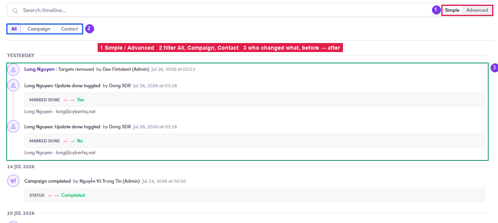

# A4.6 · Timeline / audit

> A4 · Manage a campaign (Admin)

## A4.6.1

The **Timeline** tab logs **who changed what, when**, with the **before → after** value: *STATUS — → Completed*, *MARKED DONE — → Yes*, *CATEGORIZE OutOfOffice → NotInterested*. Entries name the actor (*by Dong SDR*, *by Fintalent System (Admin)*).

*A4.6 — ① Simple / Advanced search · ② scope All / Campaign / Contact · ③ actor + before→after on every entry.*

## A4.6.2 · Advanced search syntax

`-word` excludes · click a pill to toggle it · `"quotes"` for an exact match · **AND/OR** switches how terms join. Use it to answer “who removed those targets?” in one query.
