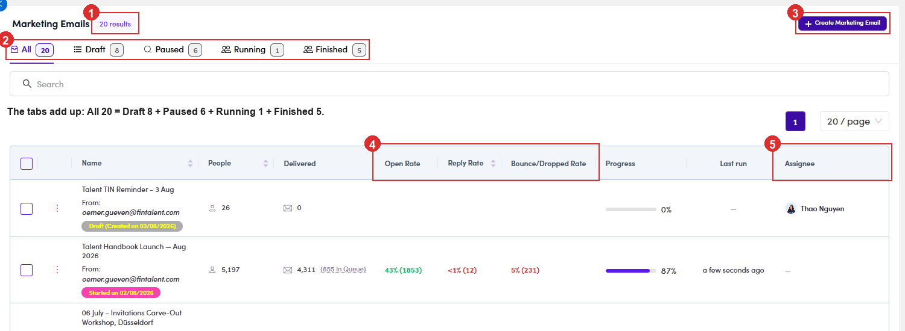

# A5.1 · The list

> A5 · Manage a marketing email (Admin)

## A5.1.1 · Sales Management → Marketing Emails

Again the **whole workspace**. Tabs: **All, Draft, Paused, Running and Finished**. There is **no Archive** here and **no folder pane**, so marketing emails sit in one flat list.

*A5.1: ① every user's MEs · ② status tabs · ③ + Create Marketing Email · ④ the rate columns.*

## A5.1.2 · Read a row

name + **From** address + status pill, **People**, **Delivered**, **Open Rate**, **Reply Rate**, **Bounce/Dropped Rate** and **Progress** (✓ when the blast finished). Then **Last run** and **Assignee**: the Assignee cell carries a **role chip** above the name (**SDR**), so you can see at a glance which rep owns which blast. There is **no Enabled toggle** though: unlike a campaign, an ME is switched on from inside its own header ([A5.7.3 ↗](a5-7-run-force-send.md)).
