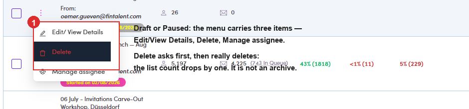
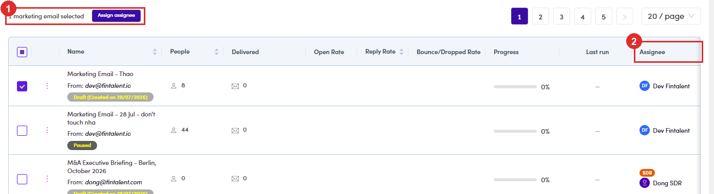

# A5.2 · Row actions

> A5 · Manage a marketing email (Admin)

## A5.2.1 · The ⋮ menu changes with status

It is short either way, but the difference matters: Whatever its status, a ME has **no Archive** to move to, and **no Clone and no Move**, unlike a campaign ([A4.2 ↗](a4-2-row-actions.md)). **Delete asks first**: *“Do you want to delete this Marketing Email”*, with **Exit** and **Delete**. It is a real delete: the list count drops by one (measured: 92 → 91), not an archive.

| ME status | ⋮ offers |
|---|---|
| **Draft** · **Paused** | Edit/View Details · **Delete** · Manage assignee |
| **Running** | Edit/View Details · **Delete** · Manage assignee, **the same three** |

> **⚠ Corrected, Delete does *not* disappear once it runs**
>
> This guide used to say the Delete option vanishes the moment a ME starts sending. **Re-checked since: it does not.** The menu offers the same three items on a Draft, a Paused and a Running ME.**What is still unverified** is what happens if you actually confirm Delete on a *running* send, whether the server refuses it or deletes a live blast. Nobody has pressed it. **Until somebody does, treat Delete on a Running ME as unsafe**: pause it first, then delete.

*A5.2.1: the ⋮ menu on a Draft: Edit/View Details, Delete and Manage assignee. A Running ME shows the same three.*

## A5.2.2 · Bulk does one thing only

Tick rows → **“N marketing email(s) selected”** → **Assign assignee**. There is no bulk delete and no bulk status change. Reassigning owners is the whole feature.

*A5.2.2: ① the selection bar with its single action · ② the Assignee column, with the role chip above each name.*
