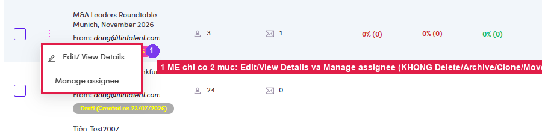

# A5.2 · Row actions

> A5 · Manage a marketing email (Admin)

1. **A5.2.1** — **⋮** gives you **Edit/View Details** and **Manage assignee**. That's all — **no Delete, no Archive, no Clone, no Move**, unlike a campaign [(A4.2 ↗)](a4-2-row-actions.md). A sent blast is a record; it stays.

   

   *A5.2.1 — two items only.*

2. **A5.2.2** — **Bulk** works the same way as campaigns: tick rows → **“N marketing emails selected”** → **Assign assignee**.
