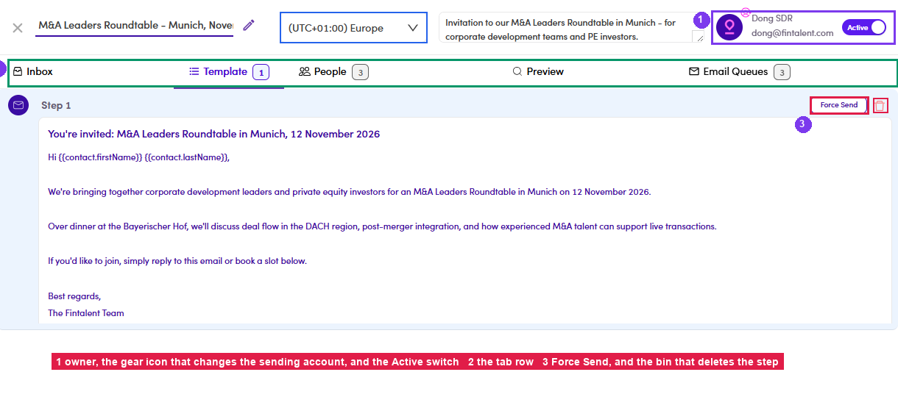
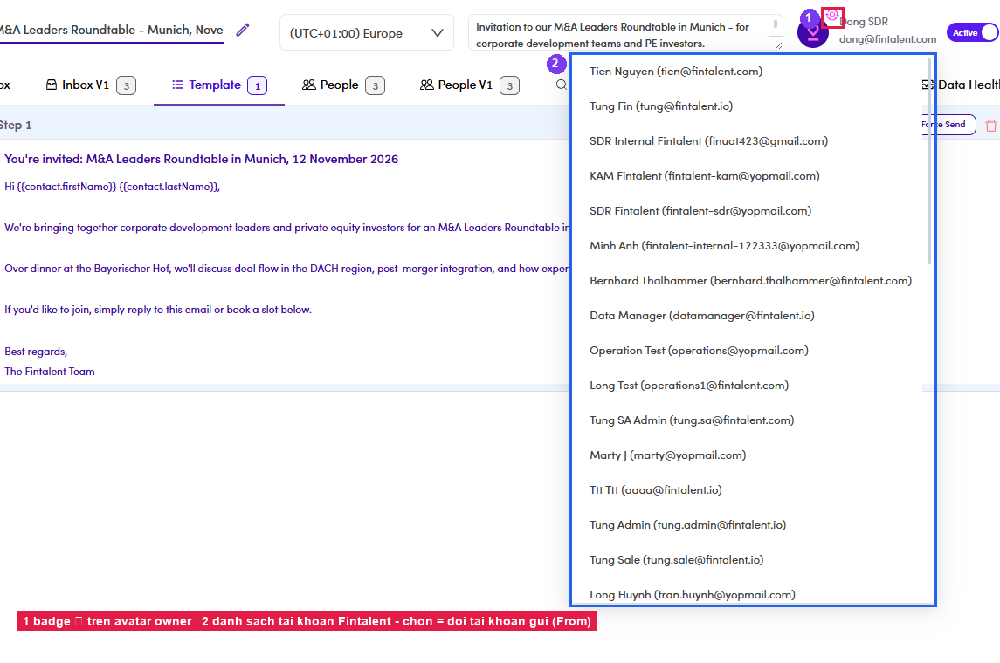

# A5.3 · Inside the ME

> A5 · Manage a marketing email (Admin)

## A5.3.1 · Open it

Header: editable **name** · **timezone** · **description** · **owner** with the **⚙** badge · the **Active** switch. Tabs: **Inbox · Template · People · Preview · Email Queues · Data Health β · Timeline**. **Two are conditional** — **Preview** renders only once the ME has at least one person, **Email Queues** only once it is past Draft. A fresh Draft legitimately shows neither, so do not read their absence as a fault. (Any “V1” duplicates you see are legacy screens — ignore them.)

*A5.3.1 — ① owner + ⚙ + the Active switch · ② the tab row · ③ Force Send and the step's delete icon.*

## A5.3.2 · Template

holds the single step. It carries the **Force Send** button from [A3.1.3 ↗](a3-1-run-a-marketing-email.md) plus a **🗑 delete** on the step — deleting it empties the ME, so only do that on a Draft.

## A5.3.3 · ⚙ on the owner avatar → change the sending account

Same control as a campaign: a list of Fintalent accounts, the current one excluded; picking one changes the account the blast sends **From**.

*A5.3.3 — ① the ⚙ badge · ② the account list. Set this before Force Send — it decides the From address and where replies land.*
