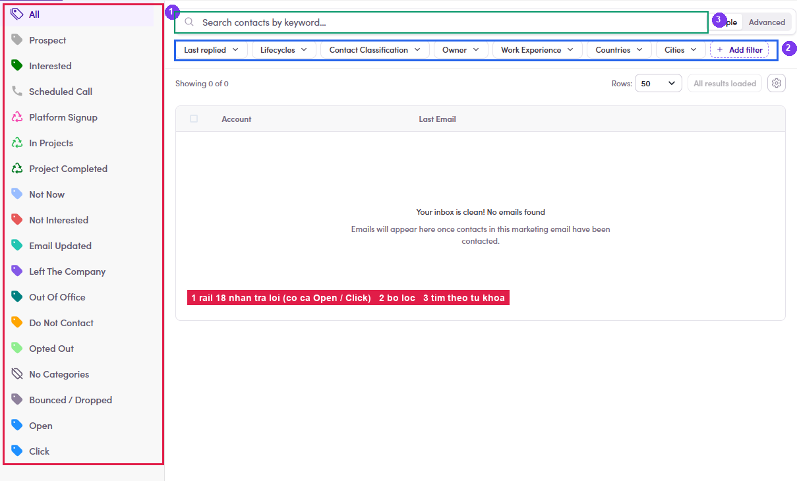

# A5.4 · The ME's own Inbox

> A5 · Manage a marketing email (Admin)

1. **A5.4.1** — The **Inbox** tab is this ME's replies only, with a category rail down the left: **All · Prospect · Interested · Scheduled Call · Platform Signup · In Projects · Project Completed · Not Now · Not Interested · Email Updated · Left The Company · Out Of Office · Do Not Contact · Opted Out · No Categories · Bounced / Dropped · Open · Click**.

   

   *A5.4 — ① the category rail (Open and Click are engagement, not replies) · ② filters · ③ keyword search.*

2. **A5.4.2** — **Bounced / Dropped** and **Opted Out** are the two to read first after a blast — they decide whether the next ME to that segment should go out at all.
