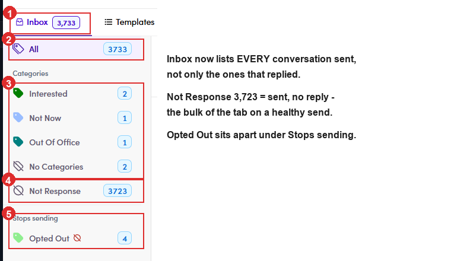

# A5.4 · The ME's own Inbox

> A5 · Manage a marketing email (Admin)

> **⚠ Changed. This tab is no longer “replies only”**
>
> The **Inbox** tab on a ME (and on a campaign) now lists **every conversation that went out**, i.e. everything delivered, not just the ones that came back. Because of that the left rail carries a **Not Response** chip: conversations that were **sent and never answered**. A worked example, *Talent Handbook Launch — Aug 2026*: **All 3,733** = Interested 2 + Not Now 1 + Out Of Office 1 + No Categories 2 + **Not Response 3,723** + Opted Out 4. The categories and **Not Response** add up to **All**, so **Not Response is the bulk of the tab** on any healthy send. Silence is the normal outcome, and the few categorised rows are the work. **Opted Out sits apart**, under its own *Stops sending* group with a 🚫 mark, not a reply category but a hard stop ([7.9 ↗](7-9-label-the-replies.md)).

*A5.4: the left rail: ① the Inbox tab count, matching All · ② All 3,733 · ③ the reply Categories, six rows between them · ④ Not Response 3,723, the silent majority · ⑤ Stops sending → Opted Out 4, kept out of the categories.*

## A5.4.1

The **Inbox** tab is this ME's replies only, with a category rail down the left. The rail lists **All, Prospect, Interested, Scheduled Call, Platform Signup, In Projects, Project Completed, Not Now, Not Interested, Email Updated, Left The Company, Out Of Office, Do Not Contact, Opted Out, No Categories, Bounced / Dropped, Open** and **Click**.

*A5.4: ① the category rail (Open and Click are engagement, not replies) · ② filters · ③ keyword search.*

## A5.4.2 · Bounced / Dropped

and **Opted Out** are the two to read first after a blast, they decide whether the next ME to that segment should go out at all.
