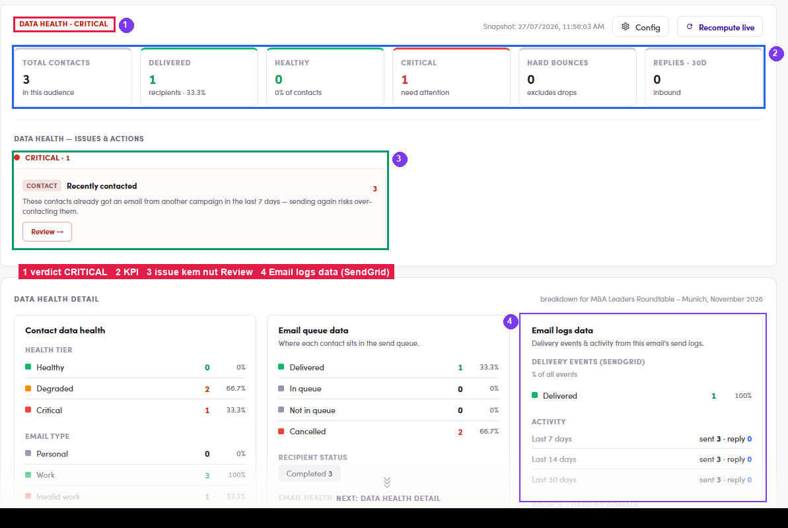
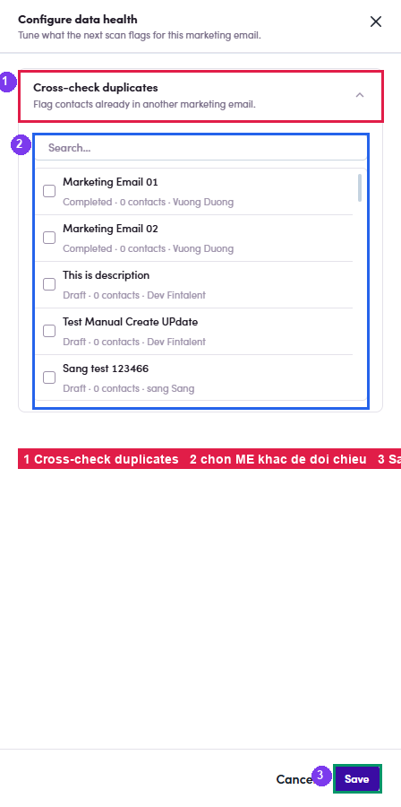

# A5.5 · Data Health + Config

> A5 · Manage a marketing email (Admin)

1. **A5.5.1** — **Recompute live** → verdict + cards: **Total contacts · Delivered · Healthy · Critical · Hard bounces · Replies · 30d**.

   

   *A5.5.1 — a real CRITICAL verdict: ① badge · ② cards · ③ the issue with its Review → · ④ Email logs data (SendGrid delivery events + 7/14/30-day activity).*

2. **A5.5.2** — **Read the issue, not just the badge.** In the example above the ME is Critical because of **Recently contacted**: *“these contacts already got an email from another campaign in the last 7 days — sending again risks over-contacting them”*, 3 of 3. **Review →** opens exactly those people.

3. **A5.5.3** — **Email queue data** here also shows **Cancelled** and a **Recipient status** line (*Completed 3*) — the difference between “we tried to send 3” and “1 actually got delivered”.

4. **A5.5.4** — **Config** (top-right, ME-only). *“Tune what the next scan flags for this marketing email”* → **Cross-check duplicates**: tick the other MEs whose audiences should be treated as overlap → **Save**. Use it when you run a series to the same segment and want the scan to catch the repeat.

   

   *A5.5.4 — ① Cross-check duplicates · ② pick the other MEs · ③ Save.*
