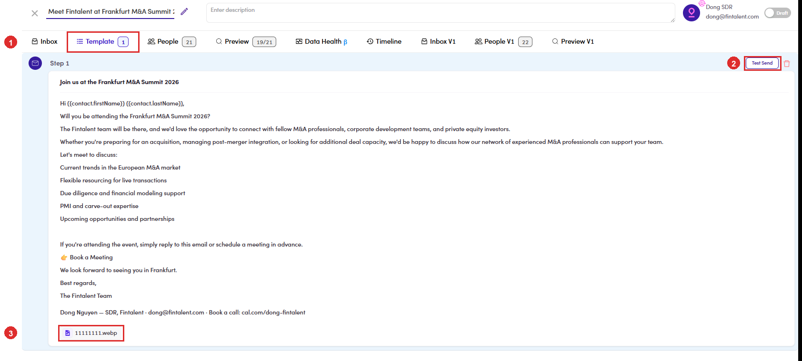
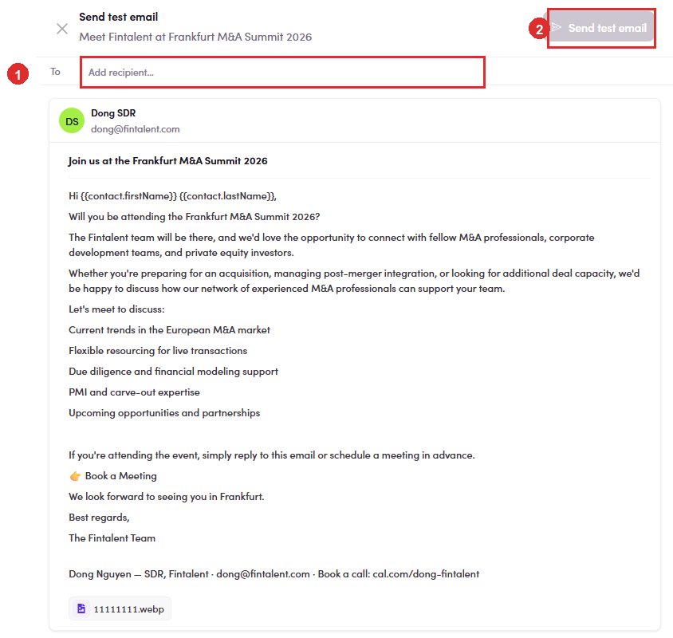
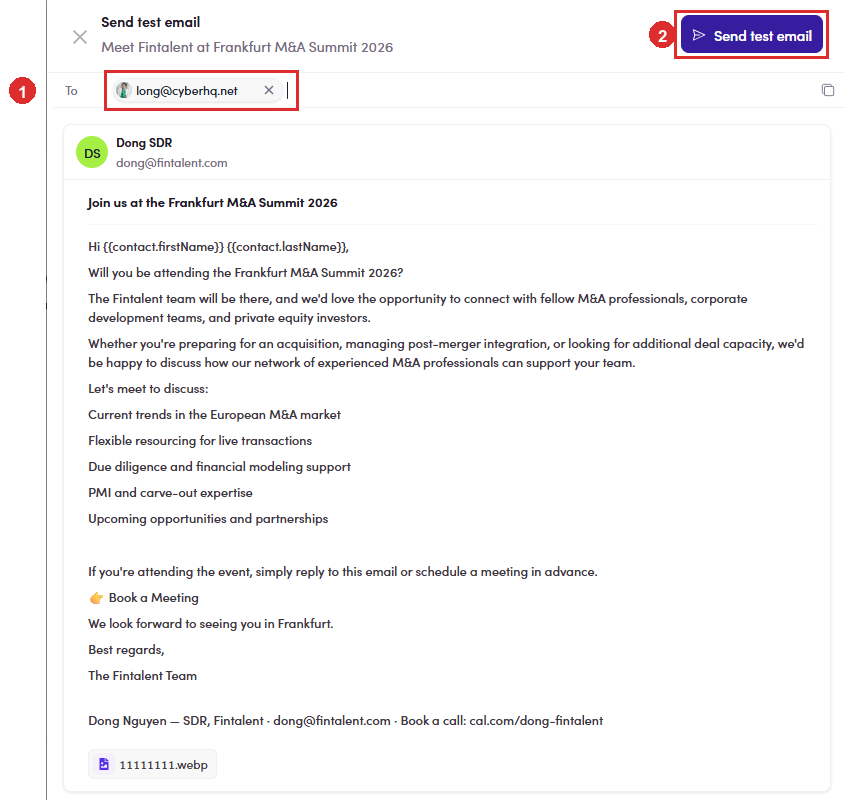
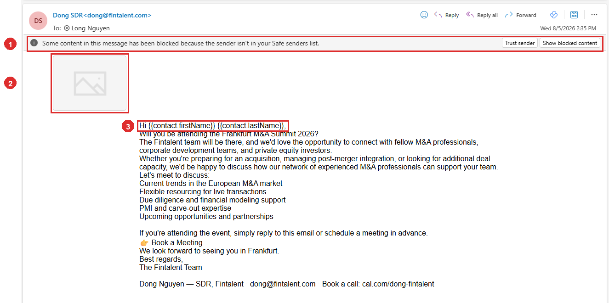

# A5.7 · Test send

> A5 · Manage a marketing email (Admin)

A marketing email goes to everyone at once, and there is no recall. **Send it to yourself first** and read the copy that arrives, not the one in the editor. You are checking four things: that it leaves at all, that the whole email is there, that the attachment came with it, and that it is readable in a real mail client.

## A5.7.1 · Open the ME → Template tab

The button is **Test Send**, top right of the step. It only exists once the template has been written, so on a brand new ME you will not find it until there is a step to send.

*A5.7.1: ① the Template tab · ② Test Send, beside the 🗑 on the step · ③ the attachment, which is one of the things the test is for.*

## A5.7.2 · The drawer opens with the email already in it

Title **Send test email**, the subject underneath, the sending account at the top, and the full body with its attachment below. The only empty field is **To**, and **Send test email** stays greyed out until you fill it.

*A5.7.2: ① To, empty, reading \*Add recipient…\* · ② the send button, greyed out until there is one.*

## A5.7.3 · Type an address you can actually open

Any address works: your own Gmail, your Outlook, a shared team mailbox. It does not have to be a Fintalent address and it does not have to exist in the system. Once the chip appears, the button turns solid. **You can add more than one**, and it is worth doing. Gmail, Outlook and a corporate mailbox do not render the same email the same way, and sending to all three at once shows you the differences side by side rather than one test at a time.

*A5.7.3: ① the address as a chip, with an ✕ to take it off again · ② Send test email, now live.*

> **Do not test on a real contact**
>
> The field takes any address, including one belonging to a contact on the **People** tab, and **the email really is sent**. There is no test mode at the other end. A prospect would receive an unfinished email with the merge tags showing, from the campaign you were about to run properly. Use your own inbox.

## A5.7.4 · Now read the email that arrived, not the one on screen

This is the whole point of the step, so go through it deliberately: Anything genuinely wrong gets fixed on the **Template** tab and tested again. Only then move on to the run ([A5.8 ↗](a5-8-run-force-send.md)).

| Check | What you are looking for |
|---|---|
| It arrived | and in the inbox, not in spam. Spam on your own test is a warning about the domain, not about the copy. |
| The sender | **From** shows the account you meant to send as ([A5.x.4 ↗](a5-x-4-switch-sender-safely.md)). |
| The subject | complete, and not cut off in the list view. |
| The body | every paragraph present, spacing intact, no block silently dropped. |
| The attachment | there, and it opens. |
| The links | the booking link and any tracked link go where they should. |

*A5.7.4: the same email in an Outlook inbox. ① the client has blocked part of the message because the sender is not trusted · ② which is why the image is a grey placeholder · ③ the merge tags have arrived as written.*

> **Two things look broken and are not**
>
> **The merge tags stay as text.** A test send has no contact behind it, so **{{contact.firstName}}** has nothing to resolve to and comes through literally. In a real send it fills in per person, which is what the **Preview** tab is for. **Images can be blocked by the receiving client.** Outlook hides remote content from senders that are not on the safe list and says so in a bar at the top. That is your mail client, not the email. Click **Show blocked content** and check it properly before deciding the picture is broken.
