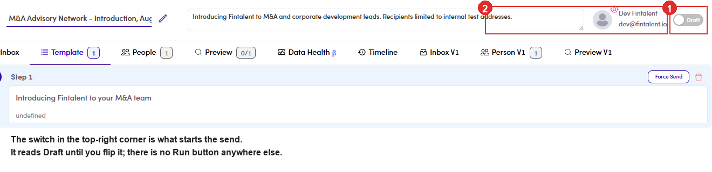
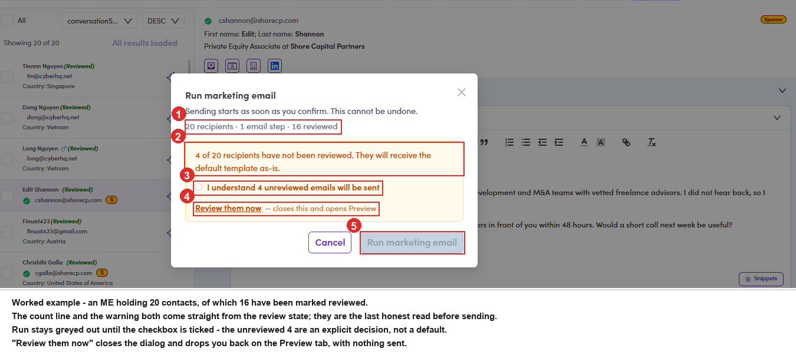
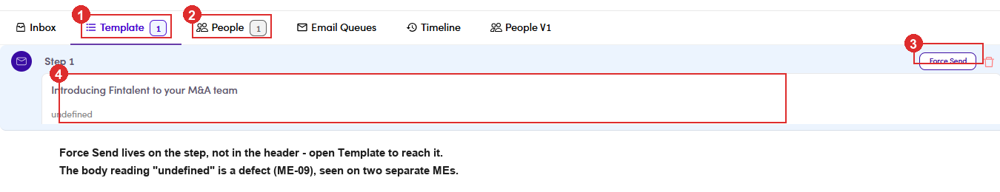
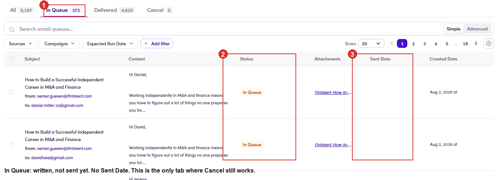
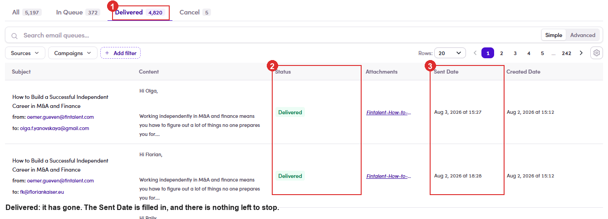
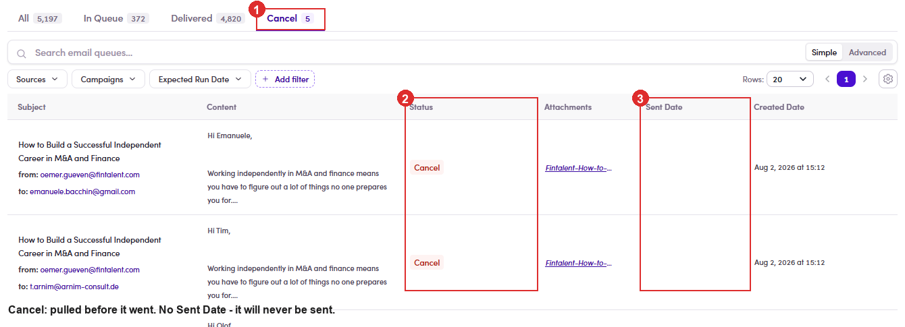

# A5.8 · Run + Force Send

> A5 · Manage a marketing email (Admin)

> **This is the handover point**
>
> The SDR builds the ME and marks people reviewed ([Flow 7 ↗](7-manage-a-marketing-email.md)). **Only an Admin can make it send.** Both controls below are invisible to the SDR login, so if a rep says “I finished it and nothing happened”, this is the step nobody did.

## A5.8.1 · Open the ME

Left menu → **Sales Management → Marketing Emails**, then click its name. The list tabs are **All, Draft, Paused, Running and Finished**, anything waiting on you is under **Draft**.

## A5.8.2 · Before you run it, check how much of it has been reviewed

The number lives on the **Preview** tab badge, and it reads **reviewed / total**. This is the one number worth stopping for. **Force Send only reaches reviewed contacts** ([A5.x.2 ↗](a5-x-2-force-send-scope.md)), so a half-reviewed ME quietly sends to fewer people than the People count suggests, and the Run dialog will tell you the same thing again in [A5.8.3 ↗](a5-8-run-force-send.md), which is your second chance to notice.

| Preview badge | What it means |
|---|---|
| **5,197 / 5,197** | everybody has been reviewed. Safe to run. |
| **0 / 1** | nobody has. The SDR has not finished: send it back rather than running it. |
| anything in between | part-reviewed. The unreviewed ones still go out, and they go out on the **default template as-is**. |

## A5.8.3 · Activate it

the switch at the **very top right** of the drawer, reading **Draft**. Flip it and a confirm opens, **Run marketing email**: “Sending starts as soon as you confirm. This cannot be undone.” Under that sits a count line reading **recipients, email steps, reviewed**, and a warning that unreviewed recipients “will receive the default template as-is”. Then comes a checkbox, **I understand N unreviewed emails will be sent**. It keeps the **Run** button **disabled** until you tick it. Last is a **Review them now** link, which closes the dialog and opens Preview. Confirm and the ME becomes **Active** (the list calls this **Running**), and the row picks up a **Started on** date in place of **Draft (Created on…)**.

> **Read the three numbers before you tick anything**
>
> Say the ME holds **20 contacts** but only **16** have been marked reviewed. The dialog prints **20 recipients, 1 email step and 16 reviewed** and, underneath, **4 of 20 recipients have not been reviewed. They will receive the default template as-is.** Those 4 still go out: on the untouched template. A reading of **0 reviewed** means nobody on the SDR side has started; that is the moment to send it back rather than confirm.

> **Active is not the same as queued**
>
> Ten minutes after confirming, an ME can still read **Active** with **People 20** and **Delivered 0** while both its own **Email Queues** tab and the site-wide **Email Queues** page show **0** rows. Activating sets the ME running; it is **Force Send** ([A5.8.4 ↗](a5-8-run-force-send.md)) that pushes the emails into the queue. Do not read an empty queue straight after Run as a failure.

> **It is easy to miss**
>
> The switch sits right at the edge of the drawer, above the tab bar and past the description box. On a **narrow** browser window it can be pushed off the right-hand edge, widen the window rather than assuming the ME has no switch. It can fail the other way too: on a **very wide** window the whole header, name, description, owner and this switch, sometimes comes back **blank** and stays blank. So if the top of the drawer looks empty, **resize the window** before concluding anything is broken.

*A5.8.3: ① the switch, reading Draft until you flip it · ② the owner block beside it. There is no Run button anywhere else on the screen.*

*A5.8.3: the confirm, on a real ME: ① 20 recipients · 1 email step · 16 reviewed, read this line first · ② the amber warning naming the 4 unreviewed · ③ the acknowledgement you must tick · ④ Review them now, which backs out to Preview with nothing sent · ⑤ Run marketing email, greyed out until the box is ticked.*

## A5.8.4 · Force Send

on the **Template** tab, top-right of the **Step 1** panel, beside the red delete-step bin. This is the button that actually pushes the emails into the queue. **Only contacts the SDR marked *Content Reviewed* are sent.** Anyone left unreviewed stays put: which is the safety net, and also the usual reason the queue comes out smaller than the People count. Its confirm is much thinner than the Run oneIt shows the Subject and the Content and nothing else, **no recipient count, no mention of attachments**. The merge fields are still raw (**{{contact.firstName}}**), and it is titled **“Force Send Campaign Flow”** even on a Marketing Email. Take your numbers from the Run dialog, because this one will not repeat them. At zero reviewed, nothing is queued, and nothing says soWorked example: an ME with 3 recipients, activated and force-sent with **0 reviewed**, produced **an empty Email Queue tab and no message of any kind**. It reads exactly like a failed send. Marking all 3 reviewed and force-sending again produced all 3 rows at once.

*A5.8.4: ① the Template tab, where Force Send lives · ② People, the recipient count · ③ Force Send, on the step itself rather than in the header · ④ the step body. Note it reads undefined here, a defect reproduced on two separate MEs.*

## A5.8.5 · Check the Email Queue tab

One row per email, and every row sits in exactly one of three states. The three counts add up to **All**. On *Talent Handbook Launch — Aug 2026*: **All 5,197 = In Queue 372 + Delivered 4,820 + Cancel 5**. The queue count should match the **reviewed** contacts, not the People count. If it comes out smaller, review is usually the reason ([A5.x.2 ↗](a5-x-2-force-send-scope.md)). Full tour of the queue, its tabs and its row actions in [7.6 ↗](7-6-email-queue-3-tabs.md). The SDR view of this tab can show 0 or “Couldn’t load” for a while, a display lag, not a failed send.

| Status | What it means | Sent Date | Can you still stop it? |
|---|---|---|---|
| **In Queue** | written and waiting. It has not gone anywhere yet, and it will go out on its own at the end of the day in the ME’s timezone. | **empty** | **Yes**: this is the only state you can cancel from. |
| **Delivered** | gone. It reached the mail provider and left. | **filled in** | **No.** There is nothing left to stop. |
| **Cancel** | pulled out of the queue before it went. It stays on the record as a row so you can see it existed. | **empty** | : already stopped; it will never send. |

> **Cancel only reaches the In Queue tab**
>
> Once a row flips to **Delivered** the email is out of your hands. If you need to pull something, pull it **before** the daily release. That is the entire window.

*A5.8.5: In Queue 372: ① the tab · ② the amber In Queue chip · ③ Sent Date empty. Nothing has left yet.*

*A5.8.5: Delivered 4,820: ① the tab · ② the Delivered chip · ③ Sent Date filled in. That is how you tell it really went.*

*A5.8.5: Cancel 5: ① the tab · ② the red Cancel chip · ③ Sent Date empty. Pulled before it sent, kept as a record.*

## A5.8.6 · Then hand it back

Replies land in the ME's own **Inbox**, and the SDR works them from there ([Flow 7 ↗](7-manage-a-marketing-email.md)). Your part is done once the queue looks right.
