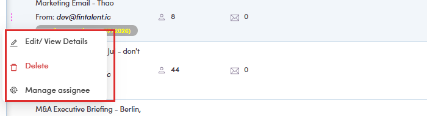
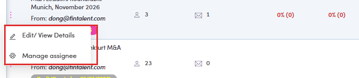

# A5.x.1 · No delete / archive

> A5 · Manage a marketing email (Admin) → A5.x · Edge cases

**Delete exists, but it disappears the moment the ME starts.** The row **⋮** is short and changes with status: So the window for deleting is **before it has ever run**, or while it is paused. Once a ME has started it stays in the list for good — there is no archive to move it to either. Two statuses exist in the data that you never see**Archived** and **Scheduled** are valid marketing-email statuses in the API and both appear in the status filter, but the list has **no tab for either** and no row action produces one. On UAT the five tabs account for every record (57 + 11 + 19 + 4 = 91). Treat them as not implemented rather than as something you can reach.

| ME status | Row menu |
|---|---|
| **Draft** | Edit/View Details · **Delete** · Manage assignee |
| **Paused** | Edit/View Details · **Delete** · Manage assignee |
| **Running** (“Started on…”) | Edit/View Details · Manage assignee — **no Delete** |

*A5.x.1 — a Draft ME: Delete is there.*

*A5.x.1 — the same menu on a Running ME: Delete is gone.*
