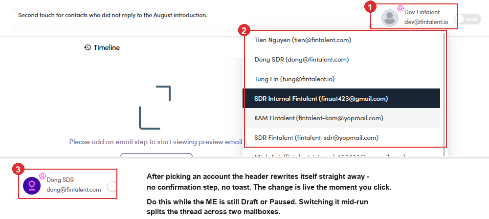

# A5.x.4 · Switch sender safely

> A5 · Manage a marketing email (Admin) → A5.x · Edge cases

**Change the sending account before, never during.** The **⚙** sits on the owner avatar in the top-right of the ME header. Clicking it drops the full list of accounts, and picking one **applies immediately**, no confirmation, no toast, the header simply rewrites itself. Never mid-runSwitching the account on a **Running** ME splits the thread: what already went out keeps the old **From**, and replies to it land in the old inbox. **Pause → switch → resume.** Because the control asks for no confirmation, there is nothing to catch a mis-click, check the ME status before you touch it.

*A5.x.4: ① the owner avatar with its ⚙ badge · ② the account list it opens · ③ the header a second later, now reading the new account. The switch takes effect on the spot, with nothing to confirm.*
