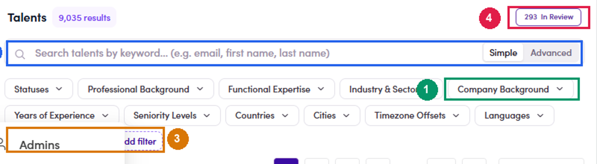
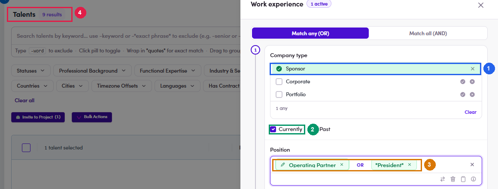

# A6.2 · Build your working list

> A6 · Talent Active / Passive

1. **A6.2.1** — **Open *User Management → Talents*.** Note the four controls you will use:

   

   *A6.2.1 — ① Company Background chip — the first cluster · ② keyword search box with a Simple / Advanced toggle · ③ Add filter — pins filters that are not on the bar by default · ④ N In Review — the review queue, see [A6.x.1 ↗](a6-x-1-new-sign-ups-to-approve.md).*

2. **A6.2.2** — **First cluster — Company Background = PE / VC.** Open the chip and tick **all six boxes** in the *Private Equity / Venture Capital* branch: **Tick the parent AND all five children.** The parent alone returns 262, the five leaves alone return 276 — **14 people carry only a leaf label and no parent label**. Miss either side and you lose them. **Also tick *PE-Backed / Portfolio Company***, in the *Corporate / Industry* branch. It is the box that ought to deliver group C, so it belongs in the routine — but it currently returns **nobody**, so the total stays at 276. Reach group C through the Work Experience filter instead: [A6.x.6 ↗](a6-x-6-no-filter-finds-portfolio-company-bosses.md).

   | Box to tick | People (production) |
   |---|---|
   | **Private Equity / Venture Capital** (the parent) | 262 |
   | Mega-Cap PE | 16 |
   | Upper Mid-Market PE | 29 |
   | Mid-Market PE | 234 |
   | Venture Capital | 0 |
   | Growth Equity | 4 |
   | **PE-Backed / Portfolio Company** (under *Corporate / Industry*) | **0** |
   | **Combined** | **276** |

3. **A6.2.3** — **Split it into two working lists** by adding the **Statuses** chip. Each list is fixed in one direction, which is what keeps the work simple: Do one list at a time. Mix them and you lose track of which way a change was going.

   | Set Statuses to | You are looking for | Worked in |
   |---|---|---|
   | `Passive` | people wrongly shut out of project invitations | [A6.4 ↗](a6-4-passive-who-should-be-active.md) |
   | `Active` | clients still sitting in the talent pool | [A6.5 ↗](a6-5-active-who-should-be-passive.md) |

4. **A6.2.4** — **Narrow further with the keyword search box.** Switch it to **Advanced** and the syntax hints appear right under it: Useful passes: `-consultant -advisory -advisor` strips out service providers; `"operating partner" "managing partner" principal` surfaces the buy-side titles.

   | Type | Effect |
   |---|---|
   | `partner` | matches anywhere in the profile text |
   | `"operating partner"` | quotes force a whole-word / exact-phrase match |
   | `-consultant` | a leading minus **excludes** the term |
   | `-"business development"` | excludes an exact phrase |
   | click a pill | flips it between include and exclude |
   | drag a pill onto another | groups them; the **AND / OR** control switches how the group joins |

5. **A6.2.5** — **Optional second angle — the Work Experience filter.** Company Background looks at career history; the Work Experience filter looks at **who someone works for right now**. Pin it via **Add filter** → type `work` → tick **Work Experience**. **Everything inside one numbered block must match on the same work-experience row.** *Add another experience* creates a second block, meaning a second row — not an extra condition on the first one. On production this filter returns **62** people currently at a sponsor and **156** currently at a portfolio company. Only **16** of those 62 also carry the PE/VC background label, so the two filters find genuinely different people — run both.

   

   *A6.2.5 — ① Company type: Sponsor / Corporate / Portfolio · ② tick Currently so past roles drop out · ③ Position — each Enter creates a pill; click a pill to invert it; `"quotes"` = whole word · ④ live result count.*

6. **A6.2.6** — **Freeze the list before you start reviewing.** Two ways, use both:

   - **Copy the URL.** Every filter is encoded in the address bar, so the link reproduces the exact list later.

   - **Select all → Bulk Actions → Add to list.** This gives a stable worklist you can split across people. **Bulk Actions cannot change status** — it only offers Export PDF, Add to list, Remove from list, Export CSV, Set Skip Review, Set Require Review.
