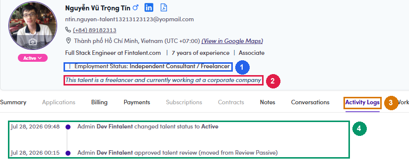

# A6.3 · How to decide

> A6 · Talent Active / Passive

Check Employment Status first. Then the title. Open work experience only when the title is not conclusive.

## A6.3.1 · Step 1 — the gate: what is their Employment Status?

This runs before you read the title, and it is the end of the line for two of the five values. **Full-time and Active on the same record is broken by definition** — the two fields contradict each other, and you do not need the title to know it. Sweep for these first: filter **Statuses = Active** and read the Employment Status column. On production there are exactly two, *Mehdi Benjelloun* and *Sahib Maker*. The system does **not** enforce this gate for you. The automatic rule at approval — [A6.x.1 ↗](a6-x-1-new-sign-ups-to-approve.md) — fires on a different condition entirely and never reads Employment Status. So a Full-time employee can and does end up Active without anyone noticing; step 1 is how you catch them.

| Employment Status | What to do |
|---|---|
| **Full-time Employee** · **Part-time Employee** | **Passive.** Stop — do not read the title. Someone else already pays for their week, so they cannot take a project whatever their headline says. |
| Independent Consultant / Freelancer · Unemployed · Other · blank | Gate passed → go to step 2. |

## A6.3.2 · Step 2 — does the job title match group A, B or C?

Match against the **role part** of the title only, i.e. the text before `at` / `@` / `chez`. Fund names very often contain the word *Partners*, and matching the whole string turns "Manager at Fide **Partners**" into a false hit. **Within this step the exclusions run first, and they are a hard stop.** If the **role part** contains any of these, the verdict is **Active** and you stop — you do not go on to the group tables. Note this only ever applies to someone who already passed the gate in step 1: a Full-time Analyst was settled as **Passive** before you got here. **Match on word boundaries.** Plain substring matching turns "M&A **Intern**ational Manager" into an intern and "Head of **Intern**ational Capital Partnerships" into a trainee — both were real false hits during the production run.

| Group | Company | Representative titles |
|---|---|---|
| **A** | PE fund (sponsor) | **Value creation & talent side.** Operating Partner · Operating Principal · Operating Director · Operating Executive · Head of Portfolio Operations · Portfolio Operations · Portfolio Director · Value Creation · Head of Operational Excellence · Head of Transformation · Talent Partner · Head of Talent · Director of Talent · Chief Talent Officer · Head of People · Human Capital · Head of Executive Talent |
| **B** | **Deal side — formal titles.** Deal Partner · Partner · Managing Partner · Senior Partner · General Partner · Founding Partner · Investment Partner · Co-Head · Managing Director · Principal · Investment Director · Investment Manager · Investment Principal · Investment Professional · Deal Lead · Vice President · VP · Director **Deal side — vocabulary, no formal title needed (added from manual review, see [A6.0 rule 5 ↗](a6-0-the-rules-in-full.md)).** Investor · Investing · Investments · Private Equity · Venture Capital · M&A · Mergers · Buy&build |  |
| **C** | PE-backed portfolio company | **Board & C-suite.** Chair · Chairman · Executive Chairman · Non-Executive Director · Senior Independent Director · CEO · Chief Executive · President · Geschäftsführer · Directeur Général · CFO · Finance Director · Group CFO · Interim CFO · Head of Finance · VP Finance **Deal & corp-dev function, any seniority (added from manual review).** Head of M&A · M&A Director · M&A Manager · Corporate Development · Corporate Dev · VP Corporate Development · Head of Strategy & M&A · Head of Transactions · Founder · Co-founder · Entrepreneur |

| Bucket | Terms |
|---|---|
| **Too junior to hold a budget** | `Associate` · `Analyst` · `Junior` · `Intern` · `Internship` · `Trainee` · `Apprentice` · `Werkstudent` · `Working Student` · `Student` · `MBA Candidate` · `Teaching Assistant` |
| **Back office — never a buyer** | `Investor Relations` · `Fundraising` · `Fund Finance` · `Capital Formation` · `Fund Accountant` · `Fund Controller` · `Taxation` |
| **Looks like a group hit but is not** | `Business Partner` — a "Finance Business Partner" is an internal finance role, not a fund Partner |

## A6.3.3 · Step 3 — does the title say they sell advice?

If the **role part** contains `consultant`, `consulting`, `consultancy`, `advisory`, `advisor` or `adviser`, they run an M&A advisory practice. **That makes them talent → Active**, even when the same title also matches a group. A "Principal **Consultant**" is a consultant, not a fund Principal. **Role part only** — the keyword must be in the job, not in the employer's name. "Managing Director and Founder at DZ **Consulting**" is a group B match and stays **Passive**; the word sits in the company name. Conversely the absence of an advisory word is equally decisive: "Founding Partner at Scandola | Buy-side M&A" has none, so the group B match stands. See [A6.0 rules 2 and 4 ↗](a6-0-the-rules-in-full.md).

## A6.3.4 · Step 4 — the title is not conclusive, so open work experience

Find the company named in the title and read its description (*industry*, *main activities*):

| What the description says | Verdict |
|---|---|
| "consulting firm", "advisory", "self-employed", "350+ consultants" | **Active** — service provider |
| "private equity sponsor", "investment firm", "alternative asset manager", "LBO" | **Passive** — buy side |
| **no description at all** | **the title stands** → Passive if it matched in step 2 |

## A6.3.5 · Shortcut — the profile often tells you outright

Under the Employment Status line the system prints its own one-line verdict, and it is the same signal the automatic rule uses: A **sponsor** or **portfolio** verdict is the strongest single hint that you are looking at a client. A **corporate** verdict is group D — deliberately out of scope, so it is not a reason to set Passive.

| Line on the profile | What produced it |
|---|---|
| *“This talent is a full-time employee”* | Employment Status = Full-time Employee |
| *“This talent is a freelancer and currently working at a **sponsor** / **portfolio** / **corporate** company”* | Employment Status = Freelancer **and** an ongoing role at a company carrying that flag. Priority when several apply: sponsor → portfolio → corporate. |
| nothing printed | neither condition holds — the automatic rule leaves them Active |

*A6.3.5 — ① Employment Status · ② the system's own verdict line, printed right below it · ③ the Activity Logs tab · ④ every status change with who made it and when.*

## A6.3.6 · The one override that beats everything above

**A status an admin set by hand stays put.** Open the *Activity Logs* tab before overturning anything: an entry naming an admin is a decision and outranks the rule; an entry with no actor, or no entry at all, is a default and the rule applies. **A completed contract is not an override.** A full-time employee who delivered a project last year is still unavailable today. Read contract history as context, never as a reason to skip the gate.
