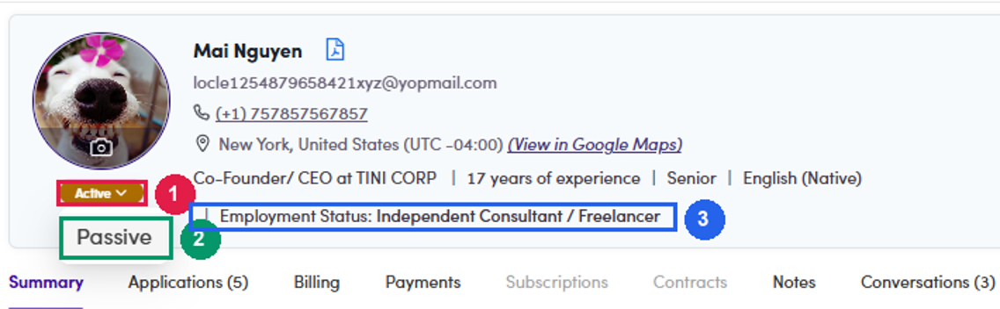
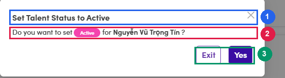

# A6.4 · Passive who should be Active

> A6 · Talent Active / Passive

Freelancers and consultants shut out of every project invitation for no good reason. **33 people** on production.

1. **A6.4.1** — **Filter:** Company Background = the six PE/VC boxes, **Statuses = Passive**. Add `-consultant -advisory -advisor` in the search box only if you want to see the harder cases first — leaving it off shows the obvious wins.

2. **A6.4.2** — **Read each row against [A6.3 ↗](a6-3-how-to-decide.md).** The frequent patterns that mean "should be Active":

   - **They were never classified by a human at all.** This is the single biggest source of this queue. Open **Activity Logs**: a lone entry saying the status changed, with **no reason attached**, means the [automatic rule at approval ↗](a6-x-1-new-sign-ups-to-approve.md) did it — purely because they held a current job at a flagged company, including a plain **corporate** one, which is group D and out of scope. Nothing about the buy side was ever checked.

   - Title openly says **consultant / advisory / freelance** — e.g. *"Private Equity Consultant"*, *"Independent Consultant at Various"*, *"Freelance in Transaction Services"*.

   - Title carries an **excluded** word — *Associate*, *Analyst*, *Intern* — **and** they passed the gate, i.e. Employment Status is not Full/Part-time. A Full-time Analyst is correctly Passive and does not belong in this queue.

   - **No current role at all**, and Employment Status is not Full/Part-time — students, people between jobs, MBA candidates.

   - Current employer is a plain **corporate** (group D) — deliberately out of scope.

3. **A6.4.3** — **Open the talent, confirm, then switch the chip to Active.** Same route as the other queue — **User Management → Talents**, click the name to open the profile drawer, then click the status chip under the avatar. On a Passive talent the dropdown offers the single option **Active**; the full click path is spelled out in [A6.5.5 ↗](a6-5-active-who-should-be-passive.md). **This direction asks for no reason.** Picking Active opens a short confirmation and that is all — which is the asymmetry worth knowing: going Passive is always explained, going Active never is. If the reason matters, write it in the **Notes** tab before you flip the chip. Hovering the chip on a Passive talent shows *Passive since <date>* plus the reason that was recorded — read it before you overturn the decision.

   

   *A6.4.3 — ① current status chip, click to open · ② the only alternative offered — the chip switches between Active and Passive and nothing else · ③ Employment Status printed on the header line, this is the gate read in [step 1 ↗](a6-3-how-to-decide.md).*

   

   *A6.4.3 — ① the dialog names the talent · ② the target status · ③ Exit cancels, Yes commits. Note there is no reason field on this direction — only the Passive direction asks for one.*

4. **A6.4.4** — **Work through the list, not the page.** Changing a status re-runs the filter, so rows shift under you. This is why [A6.2.6 ↗](a6-2-build-your-working-list.md) tells you to freeze the list first.
