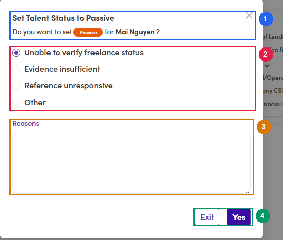

# A6.5 · Active who should be Passive

> A6 · Talent Active / Passive

Clients sitting in the talent pool — each one is a person Fintalent might accidentally pitch to as supply. **60 people** on production — the bigger of the two lists.

## A6.5.1 · Filter

Company Background = the six PE/VC boxes, **Statuses = Active**.

## A6.5.2 · Sweep the gate conflicts first — they need no judgement

With the filter above, read the **Employment Status** column and pull out every row saying **Full-time Employee** or **Part-time Employee**. Full-time and Active on the same record contradict each other, so every one of them is wrong without reading the title. Set them Passive, reason: *"Employment Status is Full-time — not available for projects."* On production this yields exactly two: *Mehdi Benjelloun* (Investment Banking Senior Analyst) and *Sahib Maker* (Vice President at Apis Partners). Sahib has one completed contract — that is context, not an exemption; see [A6.0 rule 7 ↗](a6-0-the-rules-in-full.md).

## A6.5.3 · Scan the remaining titles for buy-side vocabulary

from [A6.3.2 ↗](a6-3-how-to-decide.md). Strong signals: *Managing Partner at … Capital*, *Vice President at … Partners*, *Private Equity Investment Manager*, *Operating Partner*, *Venture Partner*.

## A6.5.4 · Open work experience and confirm the employer is a fund

The description settles it — *"Founded an independent private equity sponsor pursuing leveraged buyout transactions"* is conclusive; *"Management/Strategy Consulting"* is the opposite. Watch for a second concurrent role. Several people describe themselves as an advisor in the title while still holding a fund seat — the fund seat wins.

## A6.5.5 · Open the talent, then open the status chip

Four clicks, and the last one is the one people miss: The chip is **read-only** unless the current status is already Active or Passive. In Review, ReviewPassive, Guest and the rest are set by the review buttons instead — [A6.x ↗](a6-x-edge-cases.md).

- **User Management → Talents** in the left sidebar — the route is `/talents`.

- **Click the talent's name** in the row. The profile opens as a **full-screen drawer** over the list and the URL gains `?id=<talentId>`, so this view can be bookmarked and shared.

- **Click the coloured status chip under the avatar** — *Active ⌄*. It is a dropdown, not a label. Do not confuse it with the *Click to update* tooltip on the avatar itself, which changes the photo.

- The dropdown offers **exactly one option**, the opposite value. On an Active talent that is **Passive**. Click it.

*A6.5.5 — ① talent name, clicked from the list to get here · ② the status chip, click to open · ③ the single option offered — the chip only ever switches between Active and Passive · ④ Employment Status on the header line, the gate from [A6.3.1 ↗](a6-3-how-to-decide.md).*

## A6.5.6 · Give the reason — this direction will not commit without one

Picking Passive does not apply anything yet; it opens **Set Talent Status to Passive**, and the dialog is where the change actually happens. The four presets are *Unable to verify freelance status*, *Evidence insufficient*, *Reference unresponsive*, *Other*. Then **Yes** commits — **Exit** closes the dialog and leaves the status untouched, so you can open this screen safely just to look at it. Where the reason ends up: **not** on the talent record. It goes into the activity log and surfaces as the chip's hover tooltip — see [A6.x.7 ↗](a6-x-7-where-the-passive-reason-is-saved.md). That is why a blank free-text box means the next reviewer has nothing to go on.

*A6.5.6 — ① confirmation line naming the talent · ② four preset reasons, one must be selected · ③ Reasons free-text box — fill this in, it is the only place the real explanation survives · ④ Exit cancels, Yes commits.*

| Field | Required | What to put in it |
|---|---|---|
| **Preset reason** (radio) | **yes** — one is preselected | None of the four says "is a client", so none of them fits this flow. Pick the closest, usually *Other*. |
| **Reasons** (free text) | technically optional | **Always fill it in.** This is the only place the real explanation survives — e.g. *"Managing Partner at Contour Point Capital, an independent PE sponsor — group B."* or *"Employment Status is Full-time — not available for projects."* |

## A6.5.7 · Verify

Reload the profile: the chip reads Passive, and hovering it shows *Passive since <today>* with the reason you typed. The talent also disappears from the Active queue.
