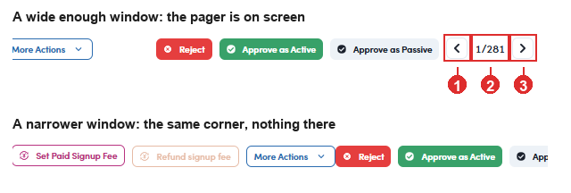

# A6-A.2 · Move between profiles

> A6 · Approve a new talent (decides Active or Passive) → A6-A · Review the In Review queue

**Move between profiles without going back to the list.** Top right of the drawer sits a pager, **‹ N/280 ›**. The **←** and **→** keys do the same thing.

> **On a narrow window, use the keyboard**
>
> The pager sits at the far right edge of the drawer and is the first thing to fall off screen. The arrow keys keep working when the buttons are not visible, so a queue can be walked end to end without ever seeing the pager.

*A6-A.2: ① previous profile · ② where you are in the queue · ③ next profile. Underneath, the same corner on a narrower window: the pager is gone, and the arrow keys are all you have.*
