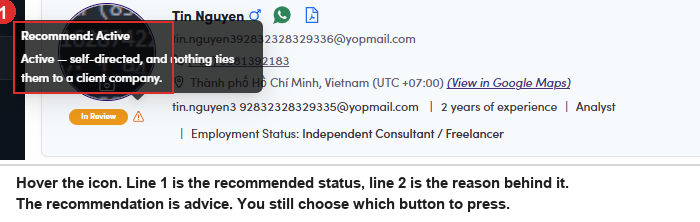

# A6-A.3 · Read the recommendation

> A6 · Approve a new talent (decides Active or Passive) → A6-A · Review the In Review queue

**Read the recommendation.** The status chip reads **In Review** and carries a **⚠ warning icon** beside it. Hover the icon and you get two lines: The full rule, all five questions and every sentence it can print, is in [A6-A.6 ↗](a6-a-6-the-rule-that-runs-today.md).

| Line | What it is | Example |
|---|---|---|
| **Recommend: <status>** | what the rule would pick if it decided | *Recommend: Active* |
| the sentence under it | which of the five questions produced that answer | *Active, self-directed, and nothing ties them to a client company.* |

*A6-A.3: hover the warning icon. Status on top, the reason underneath.*
