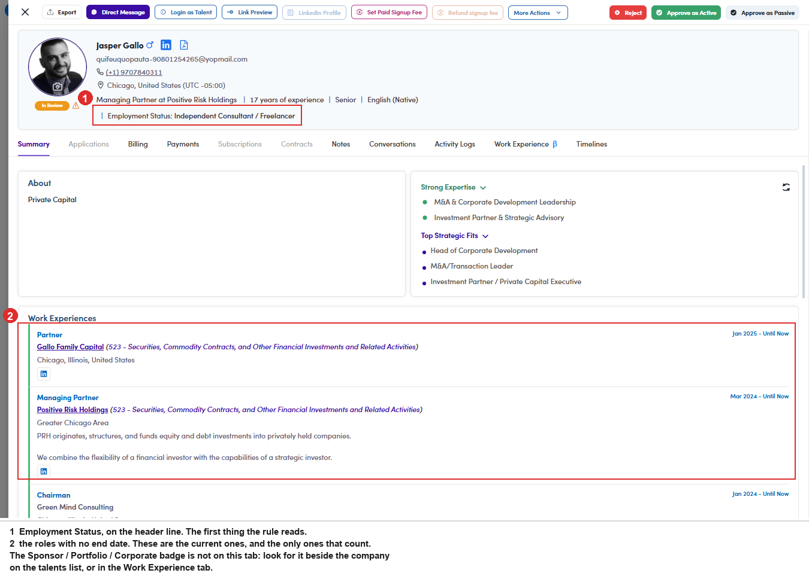

# A6-A.4 · Check it against the profile

> A6 · Approve a new talent (decides Active or Passive) → A6-A · Review the In Review queue

**Check it against the profile yourself.** The recommendation is a reading of three fields, nothing more. Read the same three before you accept it:

| What to read | Where it is | Why it matters |
|---|---|---|
| **Employment Status** | the header line, under the title | Full-time or Part-time is the strongest signal for Passive. Freelancer, Unemployed and Other point the other way |
| **Current title and company** | Work Experiences, the rows with no end date | wording like *freelance* or *independent consultant* says self-directed whatever the status field claims |
| **Company flag** | on the linked company: **Sponsor**, **Portfolio** or **Corporate** | a current role at a flagged company is the one condition that outranks everything else |

> **The recommendation is advice, not an instruction**
>
> It reads fields; it does not read judgement. A profile can be technically self-employed and still be unavailable, or say Full-time and be about to leave. That is exactly why there are two approve buttons instead of one.

*A6-A.4: ① Employment Status on the header line, the first field the rule reads · ② the roles with no end date, the only ones that count. The company flag is not on this tab.*
