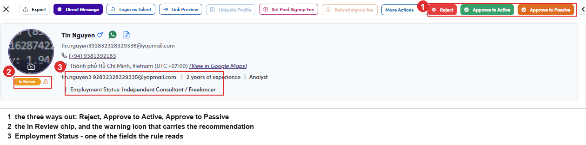
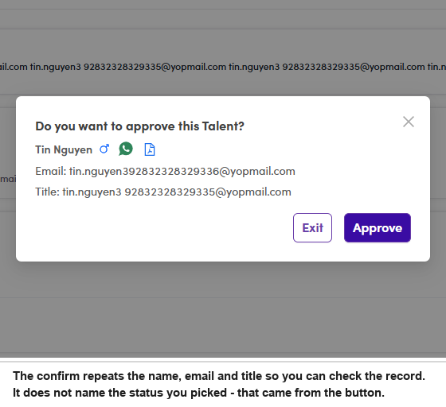

# A6-A.5 · Reject, or approve

> A6 · Approve a new talent (decides Active or Passive) → A6-A · Review the In Review queue

**Take one of the three routes, then check it landed.** The toolbar at the top of the drawer carries all three: A confirm opens repeating the **name, email and title** so you can check you are on the right record, with **Exit** and **Approve**. **What happens next:** the record leaves the queue and the count drops by one. The drawer stays open on the next profile, so a queue can be worked straight through. To confirm the status really changed, search the talent by **name or email** on the Talents list and read the chip.

*A6-A.5: the toolbar, with the three ways out: ① the three ways out · ② the In Review chip and the warning icon holding the recommendation · ③ Employment Status, the first field the rule reads.*

| Button | Resulting status | When |
|---|---|---|
| **Reject** (red) | **Rejected** | the person does not belong on the platform at all |
| **Approve to Active** (green) | **Active** | they can take project work now |
| **Approve to Passive** (orange) | **Passive** | they belong here, but somebody else already has their week |

> **The confirm does not name the status**
>
> It asks “Do you want to approve this Talent?” and nothing more. Which status you are about to set came from *the button you pressed*, and there is no second chance to read it back. Check the button colour before you confirm.

*A6-A.5: the confirm names the record but not the status.*
