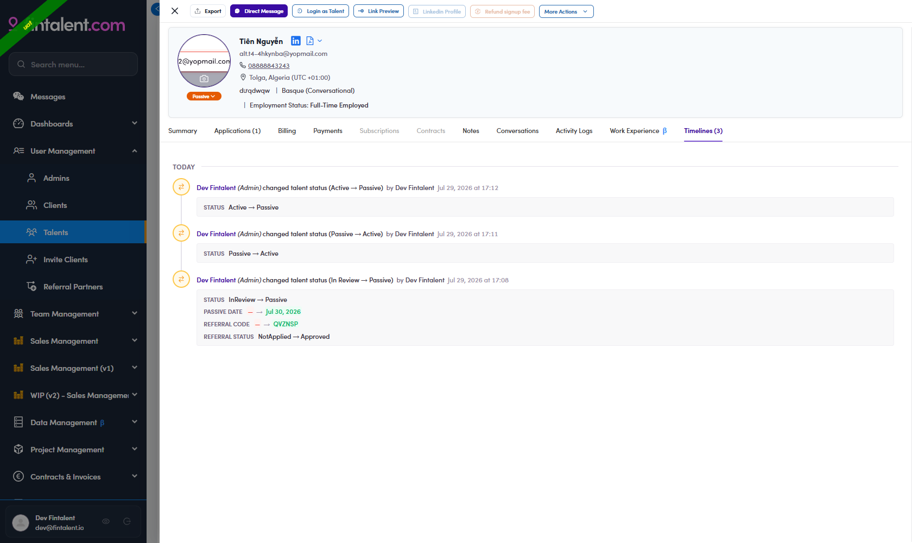

# A6-B.0 · The rules

> A6-B · Identify PASSIVE talent

**Read this once before you touch the queues.** The branch pages turn these rules into click-by-click procedures; when the two disagree, this page wins.

## The question the rules answer

Every talent record is either **supply** or **demand**. Someone who sits on the **buy side today** — they hold a role at a PE fund, or they run a company a fund owns — is a potential **client**, and Fintalent must never invite them into a project as a freelancer. They go **Passive**. Everybody else is talent and stays **Active**.

---

## Rule 1 — a hand-set status is left alone

An admin decision outranks every rule below. Open the **Timelines** tab on the profile and read what is actually there.

> ## Do not use the admin name to decide this
> **The automatic approval writes an entry with an admin's name on it too.** Verified on UAT — approving one In Review record produced:
>
> *"**Dev Fintalent** (Admin) changed talent status **(In Review → Passive)** by Dev Fintalent"*
>
> Nobody chose Passive there; the system did, and it still stamped the approving admin on the entry. If you read "has an admin name" as "hand-set", you will drop from the queue exactly the records the queue exists to find.
>
> **The discriminator is the transition inside the parentheses, not the name.**

**Three outcomes, not two.** The third is the one that gets forgotten.

| What the timeline shows | Meaning |
|---|---|
| A status change whose transition is **not** `In Review → …` | **hand-set** → drop the record from the queue |
| `In Review → Passive` **only** | the automatic rule at approval → **keep in the queue** |
| **No entry at all** | **UNKNOWN** → keep in the queue, but never record it as "automatic" |

Never infer "automatic" from silence. The talent audit log only starts around **April 2026** — see [A6-A](a6-a-identify-active-talent.md) for the measurement. Anything older simply is not written down.

### What an entry looks like

Verified on UAT by walking one record through all three transitions. Every line begins with the same *"&lt;Admin&gt; (Admin) changed talent status"* — only the transition and the detail block differ.



| Entry | Detail block underneath |
|---|---|
| `(In Review → Passive)` — the automatic rule | `STATUS InReview → Passive` **plus** `PASSIVE DATE — → <date>`, `REFERRAL CODE`, `REFERRAL STATUS` |
| `(Passive → Active)` — hand-set | `STATUS Passive → Active` only |
| `(Active → Passive)` — hand-set | `STATUS Active → Passive` only |

The extra **PASSIVE DATE / REFERRAL** lines are a second tell: only the approval writes them.

> **The tab count does not refresh.** After a change the header still reads *Timelines (1)* until you reload the page — then it reads (3). Reload before you trust the count.

### Reading the chain

Four shapes occur on production. The second is easy to miss — a naive "ignore everything on approval day" filter drops it.

| Chain | Hand-set? |
|---|---|
| `InReview → Passive`, one event | **no** — automatic rule at approval |
| `InReview → Active` then `Active → Passive`, **~20 seconds apart** | **yes** — the admin overrode the approval result |
| `Active → Passive`, long after signup | **yes** |
| `ReviewPassive → Passive` | **yes** — a [resubmit](a6-x-2-a-passive-talent-resubmits.md) that was reviewed and refused |

The reason an admin types is written to the **activity log**, not to a field on the record — see [A6.x.7](a6-x-7-where-the-passive-reason-is-saved.md).

---

## Rule 2 — the Employment Status branch

**Full-time means somebody else already pays for their week.** That is the starting position for anyone whose Employment Status says Full-time or Part-time. Two things can override it, and only two.

```
Filter: Status = Active + Employment Status = Full Time
  1. totalApplications > 0              → stays Active, stop
  2. invitationStats.totalAccepted > 0  → stays Active, stop
  3. everything else                    → rule 1 → QUEUE, consider Passive
```

Both escape hatches say the same thing in different words: this person demonstrably engages with projects, so the Full-time label is either stale or they take freelance work anyway.

**There is no recency window.** An application from any date counts.

**No work-experience test subtracts from the queue.** A record with no ongoing work experience still goes to the queue — the missing current role makes the data *less* trustworthy, not more. Use it to rank what to read first, never to keep someone Active.

> This overturns the old ruling that a completed contract is "context, never a reason to skip the gate". Application and invitation history now *do* keep someone Active. On production it means **Sahib Maker** (Vice President at Apis Partners, 21 applications, 6 accepted) stays Active where the old rulebook named him as one of two records to fix first.

---

## Rule 3 — the title branch

Filter: **Status = Active** + Employment Status = **the two non-Full-time groups** + Company Background = **PE/VC**.

Tick the **parent and all five children** of *Private Equity / Venture Capital*, plus *PE-Backed / Portfolio Company*. The parent alone returns fewer people than the leaves — some records carry only a leaf label.

> **Field decision, 30 Jul 2026: match `workExperiences[].position`, not the profile title.** The migration reads, for every **current** work-experience row, that row's **position** and its **company** — the two are already separate fields, so the *cut it at "at"* step below **disappears**: a position is the role, the company comes from the same row.
>
> Why it matters: on 172 production records with a current role, **85 (49%)** have a profile headline that matches none of their positions. The headline *"Investment Manager (Infrastructure Private Equity)"* sits on a row that reads `Investment Leader` — TIER 1 on the headline, no match on the row. The rule below is unchanged; only where the text is read from changes.
>
> The steps below still describe the headline route, because that is what a human working the list by hand can see in the table column. **For the migration, read the row.**

Then run the steps **in this order** against the **role part** of the title — the text before `at` / `@` / `chez` / `bei` / `en`. Only the role part is matched. Fund names very often contain the word *Partners*, and matching the whole string turns "Manager at Fide **Partners**" into a false hit. **Match on word boundaries** — plain substring matching turns "M&A **Intern**ational Manager" into an intern.

### Step 1 — hard-stop A: too junior, or back office → not a client

`Associate` · `Analyst` · `Junior` · `Intern` · `Internship` · `Trainee` · `Apprentice` · `Werkstudent` · `Working Student` · `Student` · `MBA Candidate` · `Teaching Assistant` · `Investor Relations` · `Fundraising` · `Fund Finance` · `Capital Formation` · `Fund Accountant` · `Fund Controller` · `Taxation` · `Business Partner`

*Business Partner* is on the list because a "Finance Business Partner" is an internal finance role, not a fund Partner.

### Step 2 — hard-stop B: sells advice, or sits sell-side → not a client

`consultant` · `consulting` · `consultancy` · `advisory` · `advisor` · `adviser` · **`investment banking`** · **`investment bank`** · `corporate finance advisory` · `transaction services` · `transaction advisory` · `due diligence` · `sell-side` · `sellside` · `restructuring advisory` · `interim manager`

An M&A advisory practice, and an investment bank, are exactly the supply Fintalent sells. This step is what keeps them out of the client queue:

| Title | Caught by |
|---|---|
| Vice President Technology & Services **Investment Banking** | `investment banking` |
| Vice President, M&A **Advisory** | `advisory` |
| Principal **Consultant** at ADC Innovations | `consultant` |
| M&A **Advisor** & Corporate Development Director | `advisor` |

### Step 3 — match the title, in two tiers

The split matters: a *Vice President* at a fund is a client, a *Vice President* at an investment bank is supply. **The same word cannot decide both.**

**TIER 1 — titles that only exist inside a fund. Client, no employer check needed.**

| Group | Terms |
|---|---|
| Operating / value creation | Operating Partner · Operating Principal · Operating Director · Operating Executive · Operating Manager · Head of Portfolio Operations · Portfolio Operations · Portfolio Director · Value Creation · Head of Operational Excellence · Head of Transformation |
| Talent side | Talent Partner · Head of Talent · Director of Talent · Chief Talent Officer · Head of Executive Talent |
| Deal side, fund-specific | General Partner · Venture Partner · Investment Partner · Deal Partner · Investment Director · Investment Manager · Investment Principal · Investment Professional · Deal Lead · Head of Investments |

**TIER 2 — generic seniority. Must pass [sub-rule 2](a6-b-3-sub-rule-2.md) before it counts.**

| Group | Terms |
|---|---|
| Partner / Principal | **Managing Partner** · **Founding Partner** · **Senior Partner** · Partner · Principal |
| Senior generic | Managing Director · Vice President · VP · Director · Co-Head |
| Board & C-suite | Chair · Chairman · Executive Chairman · Non-Executive Director · Senior Independent Director · CEO · Chief Executive · President · Geschäftsführer · Directeur Général · CFO · Group CFO · Interim CFO · Finance Director · Head of Finance · VP Finance |
| Founders | Founder · Co-founder · Entrepreneur |
| Deal / corp-dev *(manager and above)* | Head of M&A · M&A Director · M&A Manager · Corporate Development · Corporate Dev · Head of Strategy & M&A · Head of Transactions |
| People | Head of People · Human Capital |

> **Managing Partner, Founding Partner and Senior Partner belong in TIER 2, not TIER 1.** Boutique advisory firms use those exact titles. On production, *Nick Gemenetzidis — Managing Partner at Vestigos* would be flagged a client on the title alone; Vestigos describes itself as an **advisor**, so the employer check correctly drops him.

### Step 4 — no title match → not a client.

---

## Rule 4 — the title lists only work inside the Company Background filter

Every term list on this page assumes the **Company Background = PE/VC** chip is set. Words like `Investor`, `Private Equity`, `M&A`, and every TIER 2 title are ordinary vocabulary in the wider talent base — run without the chip they would sweep up most of it.

**Never run these lists without the chip in place.** [List 2](a6-b-2-title-and-background.md) is the only place they apply, and [List 1](a6-b-1-employment-gate.md) does not use them at all.

---

## Rule 5 — every branch ends in a queue, never in a change

No rule on this page sets a status. Each branch produces a list a human reads. Two output buckets, and the difference is deliberate:

| Bucket | Meaning |
|---|---|
| **Queue → Passive** | evidence is complete and points one way |
| **Needs a human read** | a title matched but the evidence is missing or contradictory |

A missing employer, an empty description, or a title with no company in it is **never** treated as confirmation. See [sub-rule 2](a6-b-3-sub-rule-2.md).

---

## What this replaces

Three rulings in the previous rulebook are deliberately reversed. They are listed so nobody re-applies them from memory.

| Old ruling | Now |
|---|---|
| "A completed contract is not an override" — contract/application history is context only | Application and accepted-invitation history **do** keep someone Active (rule 2) |
| An advisory word in the **company name** does not rescue a group match — *"Managing Director and Founder at DZ Consulting"* stays Passive | The company name **is** evidence. *Victoria Advisory*, *N-Squared Advisory*, *Borromeo Mondino Advisory GmbH* are all read as service providers |
| *"Partner and co-founder at EKEM Partners"* and *"Founding Partner at Scandola \| Buy-side M&A"* stay Passive even though a human might argue they run advisory shops | The employer decides. EKEM Partners describes itself as a **consulting firm** → not a client |
