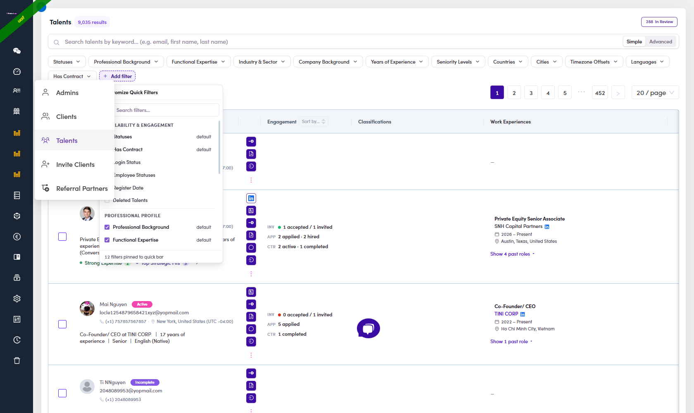
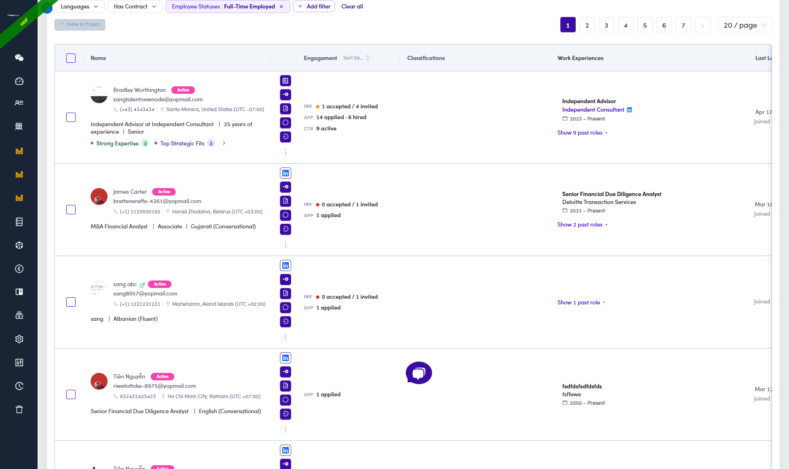

# A6-B.1 · List 1 — Active + Full Time

> A6-B · Identify PASSIVE talent

Catches people who are not available for a project at all, whatever their title says. The rule behind it: [A6-B.0 rule 2](a6-b-0-the-rules.md).

## A6-B.1.1 · Open the Talents page

**User Management → Talents.**


*A6-B.1.1 — ① the chip row · ② keyword search with a Simple / Advanced toggle · ③ **Add filter** — pins chips that are not on the row by default · ④ **N In Review**, the approval queue ([A6.x.1 ↗](a6-x-1-new-sign-ups-to-approve.md)).*

## A6-B.1.2 · Pin the Employee Statuses chip

**The chip you need is not on the bar by default, and it is not called "Employment Status".**

Click **+ Add filter**. A panel opens titled **Customize Quick Filters**, with a *Search filters…* box and the filters grouped. Under **AVAILABILITY & ENGAGEMENT** you will find:

`Statuses` *(default)* · `Has Contract` *(default)* · `Login Status` · **`Employee Statuses`** · `Register Date` · `Deleted Talents`

Tick **Employee Statuses**. It appears on the chip row. The footer of the panel tells you how many filters are pinned.



> The field on the profile header says *Employment Status*; the filter chip says *Employee Statuses*. Same thing, two names.

## A6-B.1.3 · Set two chips

| Chip | Set it to |
|---|---|
| **Statuses** | `Active` |
| **Employee Statuses** | `Full-Time Employed` |

The Employee Statuses chip has exactly **three** options — and the labels are not the raw values:

| Option on screen | Covers |
|---|---|
| Independent Consultant / Freelancer | Freelancer **and** Unemployed |
| **Full-Time Employed** | Full-time **and Part-time** employees |
| Business Owner / Partner / Boutique Owner | the "Other" bucket |

**Ticking `Full-Time Employed` also pulls Part-time.** Verified on the wire — the request sends `["FullTimeEmployee","PartTimeEmployee"]`. You cannot separate them from the chip, and that is intended: both mean somebody else pays for their week.

Each row in these dropdowns has a **✓ (include)** and a **✕ (exclude)** icon. Click the ✓.

Read the count next to the page title. On production it is **29**; on UAT the same filter returns 128.

> If the count looks like the whole base, check the Statuses chip first — leaving it empty returns every status, not just Active.

## A6-B.1.4 · Read both numbers straight off the list

**You do not need to open anybody.** The list has an **Engagement** column and it carries both numbers the rule asks for.



A cell looks like this:

```
INV  ● 1 accepted / 4 invited
APP  14 applied · 6 hired
CTR  9 active
```

| Line | Reads | Rule |
|---|---|---|
| **APP** | *n* applied · *n* hired | step 1 — any `applied` number → **leave Active** |
| **INV** | *n* accepted / *n* invited | step 2 — `accepted` above zero → **leave Active** |
| CTR | *n* active · *n* completed | contracts. Context only, not part of the rule |

**A line is only drawn when its number is above zero.** So:

* **The cell has an `APP` line** → they have applied → **leave Active**, move to the next row
* **No `APP` line, but `INV … 1 accepted`** → **leave Active**
* **No `APP` line and no accepted invitation** → this row goes to the queue → A6-B.1.5

An empty Engagement cell means no applications, no invitations, no contracts — straight to the queue.

> Sort the whole list by this column with **Sort by…** in the Engagement header, and the rows that go to the queue collect at one end. That turns the job into reading one block instead of scanning every row.

## A6-B.1.5 · Check the Timelines tab before you decide

Only for the rows that reached this step. Click the name to open the profile, then the **Timelines** tab (count in brackets). **Reload the page first if you have just changed anything — the count does not refresh on its own.**

Read the **transition in the parentheses**, not the name:

| The entry says | What to do |
|---|---|
| `(Passive → Active)`, `(Active → Passive)`, `(ReviewPassive → Passive)` | **leave this record alone.** A human decided |
| `(In Review → Passive)` and nothing else | keep it in the queue — that is the automatic rule at approval |
| **Nothing at all** | keep it in the queue. This is the normal case — the log only goes back to about April 2026 |

> **Every entry carries an admin name, including the automatic one.** Verified on UAT: approving a record wrote *"Dev Fintalent (Admin) changed talent status (In Review → Passive) by Dev Fintalent"*. The name proves nothing. See [A6-B.0 rule 1](a6-b-0-the-rules.md).

Do **not** read an empty log as "the system did it" either. It means nobody wrote it down.

While you are on the profile, the header carries two more things worth a glance:


*A6-B.1.5 — ① **Employment Status** on the header line · ② the system's own one-line verdict printed right under it, e.g. **"This talent is a full-time employee"** · ③ the tab strip · ④ the entries.*

## A6-B.1.6 · Write the row down, and rank it

Add the row to your queue with one extra note — does this person show a **current** job?

Read it off the list again: the **Work Experiences** column shows the current role as *title · company · `2023 – Present`*. If the column is empty or shows only past dates, there is no current job. Inside a profile the same thing reads **"Until Now"**.

| Note | Meaning when you review |
|---|---|
| **has a current job** | the contradiction is plain — full-time somewhere, yet Active here. Read these first |
| **no current job** | the record disagrees with itself; the Full-time label may just be stale. Read these second |

**This note never removes anybody from the queue.** It only sets the reading order.

## A6-B.1.7 · Make the change on UAT

Full click path, dialog and traps: **[A6-B.4 · Set the status Active → Passive ↗](a6-b-4-set-status-on-uat.md)**.

The reason to type for this list:

```
Employment Status is Full-time — not available for projects.
```

Pick **Other** in the radio group — the three preset reasons are about freelance verification and none of them fits.

---

## What this produced on production

| Step | Leave Active | Still in the list |
|---|---:|---:|
| Two chips set | — | **29** |
| Engagement cell shows applications | 16 | 13 |
| Timeline showed a hand-set change | 0 | **13** |

**13 rows to consider**, split by the note from A6-B.1.6:

**Has a current job — 7**

| Talent | Current role |
|---|---|
| Mehdi · tbenjelloun.mehdi@gmail.com | Senior IB Analyst @ FTI Capital Advisors |
| Simon · simon.uykun@dlapiper.com | Integrated M&A Lead @ DLA Piper |
| Teresa · exhorn94@yahoo.com | Director, HR @ Action Urgent Care |
| Ruben · rlamers@gmx.de | Transformation Manager @ GHD GesundHeits GmbH |
| Gregor · gregor@nowak.consulting | Senior IT & Tech Advisor @ Freelance |
| Chris · cxdesouza@gmail.com | Volunteer Assistant @ Finchley Foodbank · Senior PM @ Chapter Zero |
| Ömer F. · nguyenngocsang143@gmail.com | Founder @ Fintalent.com |

**No current job — 6**

Maximilian · maxpieper@hotmail.com — Dhruv · dhruv.srivastava@hotmail.com — JEAN · jeanboaretto@yahoo.com.br — Anil · anil.ziberi@gmail.com — Zac · zacp19@gmail.com — Vitaliy · vitaliy.petruk@gmail.com

## Two you should settle by hand

| Talent | Why |
|---|---|
| **Ömer F.** | `nguyenngocsang143@gmail.com`, "Founder at Fintalent.com" — an internal / test account, not a real talent |
| **Chris** | the only current roles are *Volunteer Assistant* at a foodbank and a non-profit. The rule looks at whether a job is ongoing, not at what kind of job it is |
