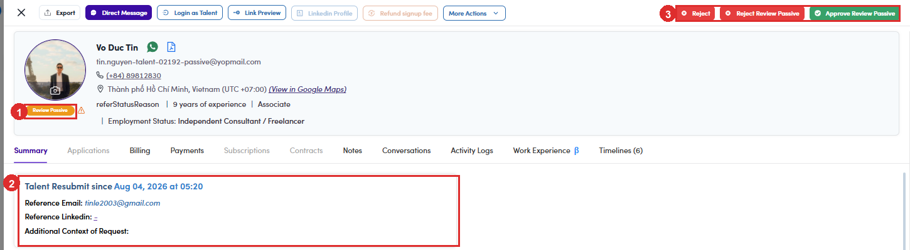
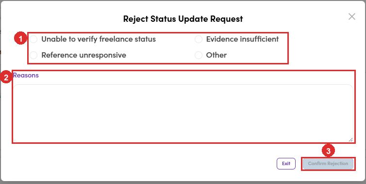

# A6-B.4 · Review Passive (they ask)

> A6 · Approve a new talent (decides Active or Passive) → A6-B · Re-check an existing status

The two flows above are you deciding to revisit somebody. **This one starts with the talent.** A person you have already filed as **Passive** can send in a request to be reassessed, and when they do, their status changes on its own to **Review Passive** and they turn up in your queue.

## A6-B.4a · They arrive in the same queue as everyone else

The button at the top right of **Talents** is labelled **N In Review**, but the number covers **both** statuses. So a resubmission is not sitting somewhere separate waiting to be noticed. It is in the queue, mixed in with the new sign-ups. **To see only the resubmissions**, filter the talents list on **Statuses = Review Passive** instead of opening the queue.

| Filter the list by | Count |
|---|---|
| Statuses = **In Review** | 278 |
| Statuses = **Review Passive** | 2 |
| the queue button says | **280** |

## A6-B.4b · Open the profile and read what they sent

A **Review Passive** profile carries the orange **Review Passive** chip, and the Summary tab opens with a block the other statuses do not have: **Talent Resubmit since <date>**, holding the evidence they supplied. **Read it against the rule the same way you would any other profile** ([A6-A.4 ↗](a6-a-4-check-it-against-the-profile.md)). The question is whether the employment situation that made them Passive has actually changed, and whether the reference backs it up.

| Field | What it is |
|---|---|
| **Reference Email** | somebody who can vouch for them. Often a different address from the one they signed up with. |
| **Reference Linkedin** | that person’s profile. A dash means they left it out. |
| **Additional Context of Request** | anything they wanted to say. Frequently empty. |

*A6-B.4b: ① the Review Passive chip · ② what the talent submitted · ③ three buttons instead of the usual two.*

## A6-B.4c · Decide, using the three buttons at the top right

They are not the same buttons a new sign-up gets, and each one says where it lands if you hover it.

| Button | Status afterwards | When |
|---|---|---|
| **Approve Review Passive** | **Active** | the change is real and the evidence holds. Confirms with *Set Talent Status to Active*. |
| **Reject Review Passive** | **Passive** | the request does not stand up. They go back where they were, not out. |
| **Reject** | **Rejected** | they should not be on the platform at all. A different decision from the one above, and much heavier. |

> **Reject and Reject Review Passive sit next to each other**
>
> One puts them back to **Passive**, which is where they already were. The other files them as **Rejected**. The labels differ by two words and the buttons are both red. **Hover before you click**, the tooltip names the status you are about to set.

## A6-B.4d · Rejecting a resubmission asks you why

**Reject Review Passive** opens *Reject Status Update Request*. Pick one of four reasons, add a note if it helps, then **Confirm Rejection**, which stays greyed out until a reason is chosen. The four are **Unable to verify freelance status**, **Evidence insufficient**, **Reference unresponsive** and **Other**. Three of them are about the reference they gave you, which is the point of collecting it: **the reason is a record of what you checked**, not a formality. **Approving asks nothing beyond a yes.** Only the rejection wants a reason, so the case for turning somebody down is written down and the case for letting them through is not.

*A6-B.4d: ① the four reasons · ② the free-text box · ③ Confirm Rejection, greyed out until you pick one.*
