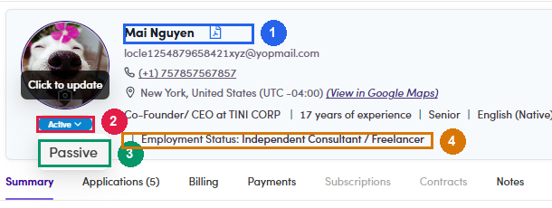
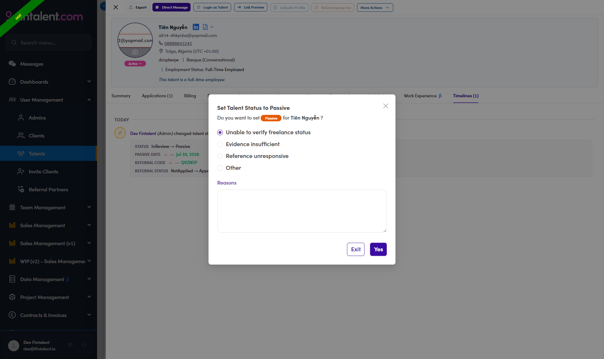

# A6-B.4 · Set the status Active → Passive

> A6-B · Identify PASSIVE talent

The last step of both lists. Same click path either way.

> ## Do this on UAT, never on production
> Production is read-only for this work. Build the list and read the data on production, then make the change on **UAT** and confirm the result there.

## A6-B.4.1 · Open the talent

**User Management → Talents** on UAT, find the person, click their name. The profile drawer opens.

Work from the list you wrote down, **not** from the page. Changing a status re-runs the filter and the rows shift under you.

## A6-B.4.2 · Find the status chip

It sits under the avatar on the left of the drawer. Hover it first — the tooltip tells you the chip is live:

| Tooltip on hover | Meaning |
|---|---|
| **"Click to update"** | the chip is clickable, go ahead |
| **"Passive since <date>"** plus a reason | already Passive — nothing to do here |
| no tooltip, chip does not open | the status is not Active or Passive, so the chip is **read-only**. See [A6.x.10 ↗](a6-x-10-send-a-talent-back-to-in-review.md) |

*A6-B.4.2 — ① the current status chip, click to open · ② the only alternative offered · ③ Employment Status on the header line.*

## A6-B.4.3 · Click the chip and pick Passive

**The dropdown shows one option: the opposite status.** On an Active record it offers only **Passive**; on a Passive record only **Active**. Verified on UAT. Rejected, In Review, ReviewPassive and the rest are set by the system or by the review actions, never here.

*A6-B.4.3 — one option only, the opposite of the current status.*

## A6-B.4.4 · Fill the confirm dialog — read this part carefully

A dialog opens, titled **Set Talent Status to Passive**, asking *"Do you want to set `Passive` for &lt;name&gt; ?"*

It has **a radio group and a free-text box**.

### The radio group — four options, one already selected

| Option | |
|---|---|
| **Unable to verify freelance status** | **pre-selected when the dialog opens** |
| Evidence insufficient | |
| Reference unresponsive | |
| **Other** | |

**None of the first three describes what you are doing in this flow.** All three belong to the freelance-verification review — they mean "we could not confirm this person is really freelancing". Neither list in A6-B concludes that:

* [List 1](a6-b-1-employment-gate.md) concludes *"employed full-time, not available"*
* [List 2](a6-b-2-title-and-background.md) concludes *"this is a client, not supply"*

**So always pick `Other`.**

> **The trap:** the dialog opens with *Unable to verify freelance status* already selected. Click **Yes** without touching the radio and that is the reason stored against the record — a wrong reason, recorded permanently, on every row you process.

### The Reasons box

The text area is labelled **Reasons**.

> **Nothing forces you to fill it in.** On UAT, picking `Other` and clicking **Yes** with the box empty saved fine — the record then shows just the word *"Other"* and no explanation at all. The field is not enforced, so typing it is on you.

Write what the rule concluded, in one line:

| List | What to type |
|---|---|
| List 1 | `Employment Status is Full-time — not available for projects.` |
| List 2 | `Buy side — <title> at <company>. Client, not supply.` |

Name the employer for List 2. Six months from now the title alone will not tell anybody why the call was made.

## A6-B.4.5 · Click Yes

The buttons are **Exit** (cancel) and **Yes**. A toast confirms it: **"Set passive talent successfully"** — or **"Set passive talent failed"** if it did not go through.

## A6-B.4.6 · Verify before moving on

Two checks, both in the drawer:

1. **The chip now reads `Passive`.** Hover it — the tooltip now says **"Passive since &lt;date&gt; at &lt;time&gt;"** followed by the radio value you picked. Verified on UAT: *"Passive since Jul 29, 2026 at 17:12 · Other"*.
2. **Open Timelines, then reload the page.** The tab count does **not** refresh on its own — it keeps showing the old number until you reload. After reloading, the new entry reads *"&lt;you&gt; (Admin) changed talent status (Active → Passive) by &lt;you&gt;"* with a detail block `STATUS Active → Passive`.

That second check matters beyond this row: it is the same entry [rule 1](a6-b-0-the-rules.md) reads. From now on this record counts as **hand-set**, and any later pass over the list will leave it alone.

## Things that will slow you down

| | |
|---|---|
| **There is no bulk status change** | Bulk Actions offers export, add / remove from list, and Set Skip / Require Review — no status. One profile at a time ([A6.x.3 ↗](a6-x-3-status-can-t-be-changed-in-bulk.md)) |
| **The chip is locked outside Active / Passive** | it only switches between those two. Anything else has to come back to In Review first ([A6.x.10 ↗](a6-x-10-send-a-talent-back-to-in-review.md)) |
| **The profile looks empty afterwards** | the reason surfaces in the chip tooltip and the activity log, not as a field on the record ([A6.x.7 ↗](a6-x-7-where-the-passive-reason-is-saved.md)) |
| **Going Passive stops nothing already running** | contracts, timesheets and invoices are unaffected. It only removes them from project invitations ([A6.x.9 ↗](a6-x-9-what-passive-does-not-affect.md)) |

## If you set one by mistake

The same chip switches back. Click it and pick **Active** — that dialog is much simpler: **"Set Talent Status to Active"**, *"Do you want to set `Active` for &lt;name&gt; ?"*, and just **Exit / Yes**. No radio group, no reason field.

Note this leaves **two** entries in the timeline — the Passive and the Active — and rule 1 will treat the record as hand-set from then on.
